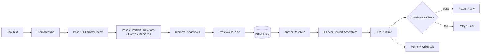
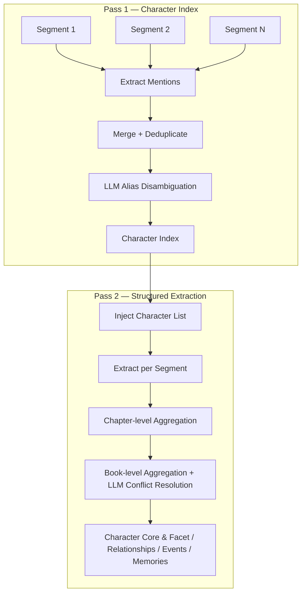
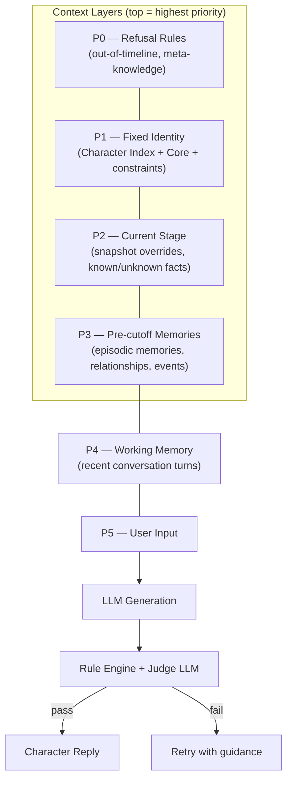
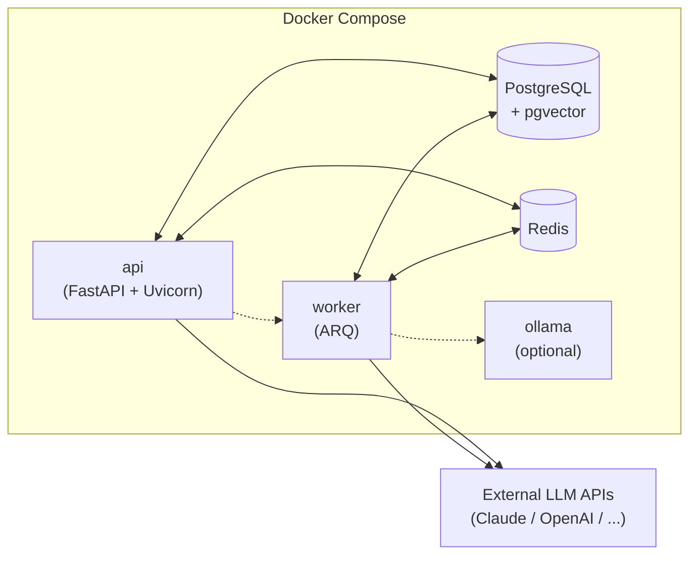
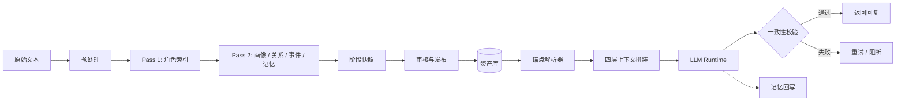
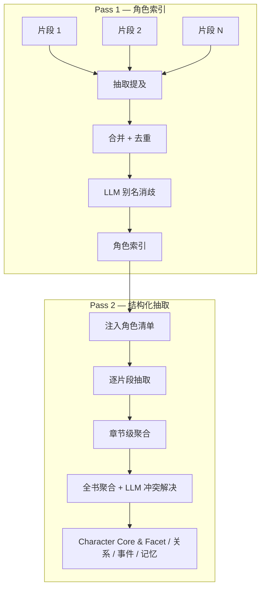
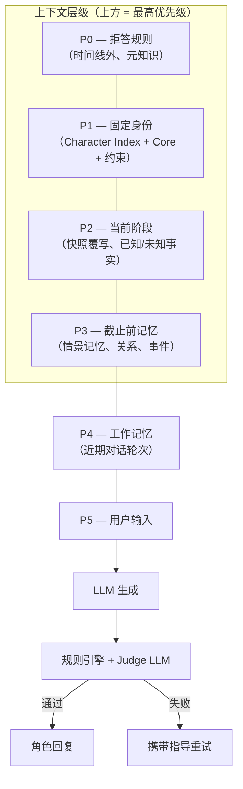
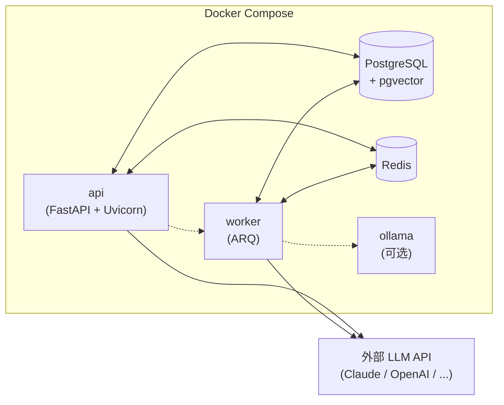

[English](#english) | [中文](#zh-cn)

<a id="english"></a>

# CAMO — Character Modeling & Simulation Base

CAMO extracts structured character data from novels, scripts, chat logs, and other unstructured text, then uses that data to power in-character conversations with timeline awareness and consistency checks.

Feed it a book, get back character portraits, relationships, events, memories, and temporal snapshots — then talk to any character at any point in the story.

## How it works

1. **Import** — bring in text sources (novels, scripts, interviews, etc.)
2. **Model** — CAMO's extraction pipeline builds character indexes, portraits, relationships, events, memories, and anchorable snapshots
3. **Talk** — create a runtime session, pick a time anchor, and chat with a character who only knows what they should know at that point in the story

## Architecture

### System overview



### Extraction pipeline

Two-pass Map-Reduce: raw text segments go through character discovery first, then structured extraction with the confirmed character list.



### Runtime context assembly

Each character turn assembles a prompt from four priority layers, filtered by the current time anchor:



### Deployment



## Repository layout

```
src/camo/
  api/          HTTP routes, middleware, demo pages
  extraction/   Text parsing, multi-pass modeling pipeline
  runtime/      Anchor resolution, consistency checks, turn logic
  tasks/        Background worker, job dispatch, memory writeback
  core/         Shared schemas and models
prompts/        Prompt templates and JSON schemas
migrations/     Alembic database migrations
config/         Model routing configuration
tests/          Automated tests
docs/           Specs and design docs
examples/       Sample outputs (e.g. Yue Buqun portrait)
```

## Quick start

```bash
# 1. Set up environment
cp .env.example .env
# Fill in your model API keys in .env

# 2. Start the stack
docker compose up --build

# 3. (Optional) Include local model service
docker compose --profile local-llm up --build
```

Once running:

| URL | What |
| --- | --- |
| `localhost:8000/docs` | OpenAPI docs |
| `localhost:8000/demo` | Demo hub |
| `localhost:8000/demo/chat` | Chat demo |
| `localhost:8000/demo/portrait` | Portrait inspector |
| `localhost:8000/healthz` | Health check |

### Docker services

| Service | Purpose |
| --- | --- |
| `api` | FastAPI app on port 8000 (runs migrations on startup) |
| `worker` | ARQ worker for modeling jobs and memory writeback |
| `postgres` | Primary database (PostgreSQL + pgvector) |
| `redis` | Session store, queue backend, rate limiting |
| `ollama` | Local model endpoint (only with `local-llm` profile) |

## Walkthrough

```bash
# Create a project
curl -X POST localhost:8000/api/v1/projects \
  -H "Content-Type: application/json" \
  -d '{"name": "My Project", "description": "Test project"}'

# Import text
curl -X POST localhost:8000/api/v1/projects/<project_id>/texts \
  -H "Content-Type: application/json" \
  -d '{"filename": "ch1.txt", "source_type": "novel", "content": "Chapter 1..."}'

# Or upload a file
curl -X POST localhost:8000/api/v1/projects/<project_id>/texts/upload \
  -F "file=@/path/to/book.txt" -F "source_type=novel"

# Start modeling
curl -X POST localhost:8000/api/v1/projects/<project_id>/modeling \
  -H "Content-Type: application/json" \
  -d '{"max_segments_per_chapter": 6}'

# Check progress
curl localhost:8000/api/v1/projects/<project_id>/modeling/<job_id>

# List characters
curl localhost:8000/api/v1/projects/<project_id>/characters

# Create a runtime session
curl -X POST localhost:8000/api/v1/runtime/sessions \
  -H "Content-Type: application/json" \
  -d '{
    "project_id": "<project_id>",
    "speaker_target": "<character_id>",
    "scene": {
      "scene_type": "single_chat",
      "description": "Test session",
      "anchor": {
        "anchor_mode": "source_progress",
        "source_type": "timeline_pos",
        "cutoff_value": 999999
      }
    }
  }'

# Chat
curl -X POST localhost:8000/api/v1/runtime/sessions/<session_id>/turns \
  -H "Content-Type: application/json" \
  -d '{"user_input": {"content": "Who are you?"}}'
```

If you set `API_KEY` in `.env`, add `-H "X-API-Key: <key>"` to your requests.

## License

MIT — see [LICENSE](LICENSE).

---

<a id="zh-cn"></a>

# CAMO — 人物建模与角色驱动基座

CAMO 从小说、剧本、聊天记录等非结构化文本中自动抽取结构化的人物资产，再用这些资产驱动带时间线感知和一致性校验的角色对话。

给它一本书，它会产出人物画像、关系图谱、事件、记忆和阶段快照——然后你可以在故事的任意时间点和任意角色对话。

## 工作流程

1. **导入** — 把文本源丢进来（小说、剧本、访谈等）
2. **建模** — 抽取管线自动生成角色索引、画像、关系、事件、记忆和阶段快照
3. **对话** — 创建运行时会话，选一个时间锚点，和角色聊天——角色只知道那个时间点之前发生过的事

## 系统架构

### 整体流程



### 抽取管线

两趟 Map-Reduce：先从原文片段中发现角色，再用确认的角色列表做结构化抽取。



### Runtime 上下文拼装

每轮角色对话从四个优先级层拼装 Prompt，所有资产按当前时间锚点过滤：



### 部署架构



## 仓库目录

```
src/camo/
  api/          HTTP 路由、中间件、Demo 页面
  extraction/   文本解析、多阶段建模管线
  runtime/      锚点解析、一致性检查、对话逻辑
  tasks/        后台 Worker、任务派发、记忆回写
  core/         共享 Schema 和模型
prompts/        提示词模板和 JSON Schema
migrations/     Alembic 数据库迁移
config/         模型路由配置
tests/          自动化测试
docs/           规格说明和设计文档
examples/       示例产物（如岳不群画像）
```

## 快速开始

```bash
# 1. 准备环境
cp .env.example .env
# 在 .env 里填入模型 API Key

# 2. 启动服务
docker compose up --build

# 3.（可选）同时启动本地模型服务
docker compose --profile local-llm up --build
```

启动后可以访问：

| 地址 | 说明 |
| --- | --- |
| `localhost:8000/docs` | OpenAPI 文档 |
| `localhost:8000/demo` | Demo 首页 |
| `localhost:8000/demo/chat` | 对话演示 |
| `localhost:8000/demo/portrait` | 画像检查 |
| `localhost:8000/healthz` | 健康检查 |

### Docker 服务

| 服务 | 作用 |
| --- | --- |
| `api` | FastAPI 应用，端口 8000（启动时自动跑迁移） |
| `worker` | ARQ Worker，处理建模任务和记忆回写 |
| `postgres` | 主数据库（PostgreSQL + pgvector） |
| `redis` | 会话存储、队列后端、限流 |
| `ollama` | 本地模型服务（仅 `local-llm` profile 下启动） |

## 调用示例

```bash
# 创建项目
curl -X POST localhost:8000/api/v1/projects \
  -H "Content-Type: application/json" \
  -d '{"name": "测试项目", "description": "本地测试"}'

# 导入文本
curl -X POST localhost:8000/api/v1/projects/<project_id>/texts \
  -H "Content-Type: application/json" \
  -d '{"filename": "ch1.txt", "source_type": "novel", "content": "第一章……"}'

# 或者上传文件
curl -X POST localhost:8000/api/v1/projects/<project_id>/texts/upload \
  -F "file=@/path/to/book.txt" -F "source_type=novel"

# 发起建模
curl -X POST localhost:8000/api/v1/projects/<project_id>/modeling \
  -H "Content-Type: application/json" \
  -d '{"max_segments_per_chapter": 6}'

# 查看进度
curl localhost:8000/api/v1/projects/<project_id>/modeling/<job_id>

# 列出角色
curl localhost:8000/api/v1/projects/<project_id>/characters

# 创建运行时会话
curl -X POST localhost:8000/api/v1/runtime/sessions \
  -H "Content-Type: application/json" \
  -d '{
    "project_id": "<project_id>",
    "speaker_target": "<character_id>",
    "scene": {
      "scene_type": "single_chat",
      "description": "测试会话",
      "anchor": {
        "anchor_mode": "source_progress",
        "source_type": "timeline_pos",
        "cutoff_value": 999999
      }
    }
  }'

# 对话
curl -X POST localhost:8000/api/v1/runtime/sessions/<session_id>/turns \
  -H "Content-Type: application/json" \
  -d '{"user_input": {"content": "你是谁？"}}'
```

如果在 `.env` 里配了 `API_KEY`，请求时加上 `-H "X-API-Key: <key>"`。

## 开源协议

MIT — 详见 [LICENSE](LICENSE)。
