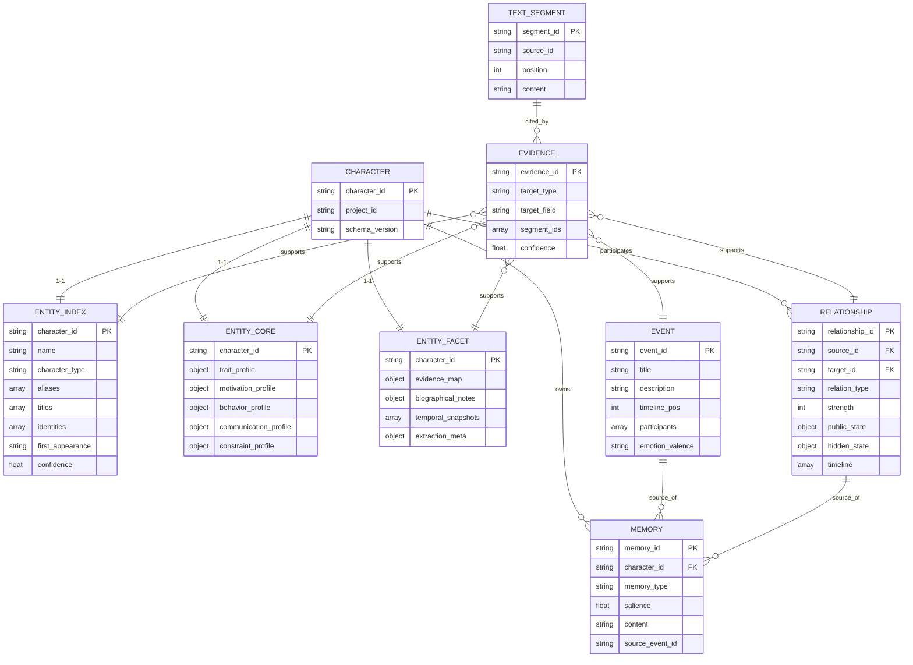
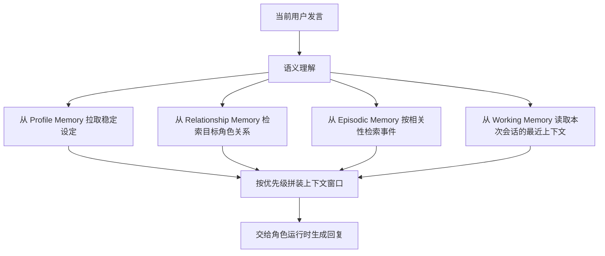
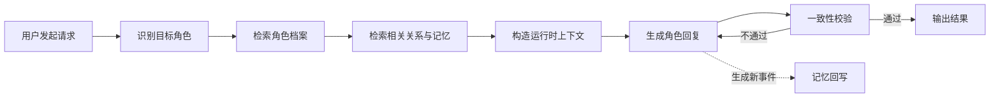
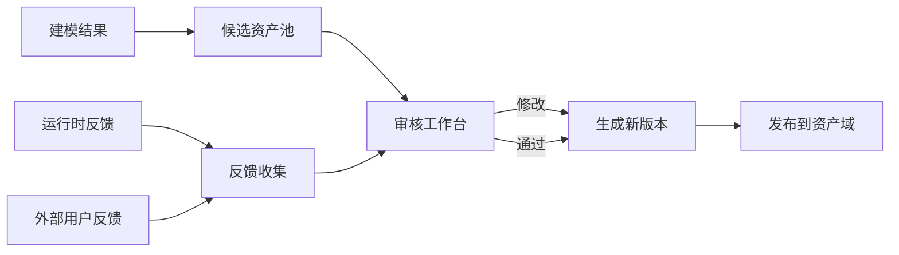

# CAMO 产品方案 v0.2

> 本版本基于 v0.1 评审意见整理，补齐了此前未梳理的模块，新增术语表、数据模型总览、非功能需求、评测体系、安全合规与里程碑章节。范围限定在产品方案之内，技术选型不在本版本讨论。

## 1. 概述

### 1.1 产品定义

CAMO 是一套面向非结构化文本的人物理解与角色驱动基座。它将小说、聊天记录、剧本、访谈、wiki 等文本输入，转化为可复用、可调用、可持续运行的角色资产，包括人物画像、人格结构、关系图谱、记忆体系、语言风格与角色扮演约束，并为上层应用提供统一的人物运行能力。

### 1.2 产品价值

把"文本中的人物"转化为"可交互、可模拟、可保持一致性的人物系统"。CAMO 面向角色类应用提供人物资产与运行时能力，不直接面向终端用户。

### 1.3 产品边界（不做什么）

为避免后续范围蔓延，本节明确 CAMO 不做的事情：

- 不做最终消费型应用。CAMO 不提供面向 C 端用户的聊天产品、游戏或内容平台。
- 不做前端 UI / 交互层。前端形态由上层应用自行决定，CAMO 只输出数据与运行时结果。
- 不做模型训练与微调。CAMO 聚焦在"使用模型能力"而非"生产模型"。
- 不做通用内容审核服务。CAMO 只做角色层面的一致性与边界约束，不承担平台级的涉政、色情、暴力等内容过滤职责，这类审核由上层应用或外部服务负责。
- 不做非人物实体的知识库。世界观、物品、地理、组织等实体的结构化建模暂不在本基座范围内。
- 不做文本版权与来源合规的校验。输入文本的版权归属、授权状态由调用方保证。
- 不做跨项目、跨租户的内容聚合与检索。项目之间默认隔离，不做跨域人物融合。
- 不做实时语音 / 视频生成。语言风格字段可供配音、表演类应用使用，但 TTS、口型、动作等不在本基座范围内。

## 2. 目标

### 2.1 总体目标

构建一个通用的人物建模与仿真基座，使系统能够：

- 从文本中自动抽取人物
- 生成结构化人物画像
- 构建人物关系图谱
- 提炼语言风格与行为规则
- 形成可供交互调用的角色资产
- 在单聊、群聊、模拟场景中驱动角色稳定输出

### 2.2 阶段目标与验收指标

#### 2.2.1 第一阶段：人物理解引擎

**功能范围**

- 文本导入
- 角色抽取
- 人物画像生成（Entity Index + Core + Facet）
- 关系图谱生成
- 证据片段回溯

**验收指标**

| 指标 | 目标 |
| --- | --- |
| 主要角色召回率 | ≥ 90% |
| 角色别名归一准确率 | ≥ 95% |
| 人物画像人工评审通过率 | ≥ 80% |
| 关系图谱主要关系召回率 | ≥ 85% |
| 证据回溯覆盖率 | 100%（每条核心结论必须可回溯到原文片段） |

#### 2.2.2 第二阶段：角色驱动引擎

**功能范围**

- 单角色可扮演
- 角色记忆读取
- 风格约束输出
- 一致性校验

**验收指标**

| 指标 | 目标 |
| --- | --- |
| 单轮对话人设一致性人评 | ≥ 4 / 5 |
| 知识边界命中率（不越界输出比例） | ≥ 90% |
| 一致性校验误杀率 | ≤ 5% |
| 一致性校验漏报率 | ≤ 10% |

#### 2.2.3 第三阶段：多角色仿真

**功能范围**

- 群聊编排
- 指定角色互相对话
- 多角色场景状态维护
- 关系驱动发言与互动

**验收指标**

| 指标 | 目标 |
| --- | --- |
| 多轮对话中每轮角色一致性人评 | ≥ 4 / 5 |
| 关系驱动发言合理性人评 | ≥ 80% |
| 多角色场景状态维护正确率 | ≥ 85% |
| 信息不对称场景（狼人杀类）规则遵守率 | ≥ 95% |

## 3. 术语表

| 术语 | 定义 |
| --- | --- |
| Entity | CAMO 建模的基本对象，当前版本只覆盖"人物"一类。未来可能扩展到其他实体（组织、物品、地点），但不在本版本范围内。 |
| Character | 一个被 CAMO 建模的人物，等同于 Entity。每个 Character 都有唯一的 `character_id`。 |
| Persona | 用于表达多个 Character 共享的角色面（group_persona、virtual_persona 等），属于 Character 的一种类型，而非独立概念。 |
| Profile | 画像。指某一类结构化描述，例如 trait_profile、motivation_profile。多条 Profile 组合起来构成 Entity Core。 |
| Asset | 资产。指 CAMO 建模产出的可调用数据整体，包括 Character、Relationship、Event、Memory、Rule 等。 |
| Entity Index | 人物建模三层中的索引层，回答"这是谁"。 |
| Entity Core | 人物建模三层中的核心层，回答"这个人核心上怎么运作"。 |
| Entity Facet | 人物建模三层中的细节层，回答"为什么这么判断、细节是什么、来源维度上还有什么补充"。 |
| Trait | 人格特质，采用 Big Five 五维度描述。 |
| Motivation | 动机与价值观，在 v0.2 版本中合并为单一维度。 |
| Relationship | 两个 Character 之间的有向关系边。 |
| Event | 文本中抽取到的关键事件，被角色记忆引用。 |
| Memory | 角色的记忆条目，分 Profile / Relationship / Episodic / Working Memory 四类。 |
| Runtime | 角色运行时。基座中负责把角色资产与当前上下文转化为角色输出的组件。 |
| Source Segment | 证据片段。原文切分后的最小单元，所有核心结论都要可回溯到某个或某组 Source Segment。 |
| Schema Version | 数据结构版本号。每一条顶层资产都带 `schema_version` 字段，以便后续迁移。 |

## 4. 目标用户

### 4.1 直接用户

直接用户指使用 CAMO 基座进行配置、管理、调用的用户群体：

- 上层应用产品经理
- AI 应用开发者
- 角色互动类产品团队
- IP 互动内容团队
- 游戏与叙事系统设计人员
- 社交模拟类产品研发团队
- 内容创作者与作者（通过上层工具使用 CAMO 做设定校对）

### 4.2 间接用户

间接用户指最终消费 CAMO 能力的终端用户：

- 小说 / 动漫 / 影视 IP 爱好者
- 角色聊天与角色扮演用户
- AI 伴侣用户
- 互动叙事与模拟世界玩家
- 社交模拟、博弈类玩法用户

## 5. 核心场景

### 5.1 文本人物建模场景

输入一部小说、剧本、聊天记录或访谈，系统自动输出：

- 人物名单
- 人物画像（Index / Core / Facet 三层）
- 关系图谱
- 关键事件
- 代表性语料
- 扮演规则

### 5.2 单角色对话场景

用户选择某一人物，与其单独对话。角色输出需要符合：

- 其身份
- 其性格
- 其知识边界
- 其语言风格
- 其与用户当前关系状态

### 5.3 多角色群聊场景

用户将多个角色拉入同一对话空间，执行以下交互：

- @指定角色发言
- 指定 A 与 B 对话
- 允许系统决定是否有人插话
- 维持角色之间的既有关系逻辑

### 5.4 社交模拟 / 博弈场景

系统在规则框架下，让多角色持续互动：

- 保留角色动机与偏好
- 根据关系图谱做行为决策
- 根据事件发展更新局部状态
- 支持回合制流程（每回合按顺序/按规则发言）
- 支持信息不对称（不同角色拥有不同可见信息，如狼人杀场景）

本场景对运行时的额外要求：

- Runtime 需支持"场景规则"参数，描述回合结构与可见性规则
- 每个角色都有独立的 working memory 视图，互相隔离
- 场景结束后可输出一次完整的回放日志

### 5.5 内容创作反向校验场景

作者或编辑上传人物设定集、剧本草稿或章节大纲，系统反向生成人物画像，再交由作者校对。用于：

- 检查设定内部是否自洽（比如动机与行为是否矛盾）
- 检查多个角色之间是否有人设重复
- 为后续的人物运行时生成基础资产
- 给作者提供"AI 读出来的人设"作为二次创作参考

本场景对建模引擎的额外要求：

- 支持"增量导入"：作者逐章节上传，画像随之演化
- 支持"差异视图"：相邻两次建模结果之间的变化一目了然

## 6. 功能架构

### 6.1 架构图

相比 v0.1，本架构图新增审核层、一致性校验在运行时中的位置，以及运行时回写记忆的反馈回路。

```mermaid
flowchart LR
    %% ===== System External: Input =====
    subgraph EXIN["系统外部：输入来源"]
        direction TB
        A1["原始文本输入<br/>小说 / 聊天记录 / 剧本 / 访谈"]
    end

    %% ===== System Boundary =====
    subgraph CAMO["CAMO 系统边界"]
        direction LR

        %% Processing Domain
        subgraph P["处理域 Processing Layer"]
            direction TB
            B["预处理层<br/>清洗 / 分段 / 别名归一 / 指代消解"]

            subgraph X["抽取与分析模块"]
                direction TB
                C1["角色抽取"]
                C2["关系抽取"]
                C3["事件抽取"]
                C4["语言风格抽取"]
                C5["人格证据抽取"]
            end

            D["人物建模引擎<br/>Character Modeling Engine"]
        end

        %% Review Domain
        subgraph V["审核域 Review Layer"]
            direction TB
            RV["人工校对与回流<br/>Review and Curation"]
        end

        %% Asset Domain
        subgraph S["资产域 Asset Layer"]
            direction TB
            E1["角色档案库<br/>Character Profiles"]
            E2["关系图谱库<br/>Relationship Graph"]
            E3["记忆库<br/>Memory Store"]
            E4["扮演规则库<br/>Role Rules"]
        end

        %% Runtime Domain
        subgraph R["运行时 Runtime Layer"]
            direction TB
            F["角色运行时<br/>Character Runtime"]
            FC["一致性校验<br/>Consistency Check"]
        end
    end

    %% ===== System External: Output =====
    subgraph EXOUT["系统外部：输出 / 消费"]
        direction TB
        G1["上层应用接口<br/>API / SDK / Service"]
        G2["应用形态<br/>角色聊天 / 群聊 / 社交模拟 / 狼人杀 / 模拟世界"]
    end

    %% ===== Main Flow =====
    A1 --> B
    B --> C1
    B --> C2
    B --> C3
    B --> C4
    B --> C5

    C1 --> D
    C2 --> D
    C3 --> D
    C4 --> D
    C5 --> D

    D --> RV
    RV --> E1
    RV --> E2
    RV --> E3
    RV --> E4

    E1 --> F
    E2 --> F
    E3 --> F
    E4 --> F

    F --> FC
    FC --> G1
    G1 --> G2

    %% ===== Feedback Loops =====
    F -. "新对话 / 新事件回写" .-> E3
    G2 -. "用户反馈" .-> RV

    %% ===== Styles =====
    style EXIN fill:#F6F8FA,stroke:#B8C0CC,stroke-width:1px,color:#1F2937
    style EXOUT fill:#F6F8FA,stroke:#B8C0CC,stroke-width:1px,color:#1F2937
    style CAMO fill:#FDFDFD,stroke:#2563EB,stroke-width:2px,color:#111827
    style P fill:#EFF6FF,stroke:#60A5FA,stroke-width:1.5px,color:#111827
    style X fill:#DBEAFE,stroke:#60A5FA,stroke-width:1px,color:#111827
    style V fill:#FEF3C7,stroke:#F59E0B,stroke-width:1.5px,color:#111827
    style S fill:#ECFDF5,stroke:#34D399,stroke-width:1.5px,color:#111827
    style R fill:#FFF7ED,stroke:#FB923C,stroke-width:1.5px,color:#111827
```



### 6.2 分层职责与上下游接口

| 层 | 核心职责 | 主要上游 | 主要下游 |
| --- | --- | --- | --- |
| 输入层 | 接收与标准化原始文本，保留原文索引 | 外部调用方 | 处理域 |
| 处理域 Processing | 预处理、抽取、建模，生成资产候选 | 输入层 | 审核域 |
| 审核域 Review | 校对建模结果，处理外部反馈，管理回流 | 处理域 / 运行时反馈 | 资产域 |
| 资产域 Asset | 存储与版本化管理角色档案、关系、记忆、规则 | 审核域 / 运行时 | 运行时 / 对外接口 |
| 运行时 Runtime | 在对话与模拟场景中驱动角色输出 | 资产域 | 对外接口 |
| 对外接口 | 统一 API/SDK 形式对外提供能力 | 资产域 / 运行时 | 上层应用 |

每一层的接口形态在功能需求章节（第 8 章）各模块的"输入 / 输出"字段中具体描述。

## 7. 数据模型总览

本节给出核心实体之间的关系总览，字段细节见第 8 章。



关键约束：

- 每个 Character 都持有一份 Index / Core / Facet，三者共享 `character_id`。
- 所有画像字段、关系、事件都通过 Evidence 与 Text Segment 绑定，以满足证据回溯的强要求。
- Relationship 是有向边，`source_id` 指向关系持有者，`target_id` 指向被指向对象。公开关系与隐含关系作为同一条边的两个属性块，不复用两条边。
- Memory 通过 `source_event_id` 可以回指 Event，Event 反过来不直接持有 Memory。

## 8. 功能需求

### 8.1 文本输入模块

#### 8.1.1 功能目标

接收外部文本，并完成进入建模流程前的标准化处理。

#### 8.1.2 输入类型

- 长篇小说
- 分章节文本
- 聊天记录
- 剧本 / 台词本
- 人物设定文档
- 访谈记录
- wiki 资料

#### 8.1.3 功能要求

- 支持粘贴文本、文件上传、分段导入
- 支持按章节、按回合、按消息顺序保存原始内容
- 支持角色别名归一化配置
- 支持文本清洗，如去噪、去格式符、异常分段修复
- 保留原文索引，供证据回溯使用
- 支持多次增量导入同一项目，保持片段 ID 稳定
- 对输入文本的字符集、编码、长度提供明确上限与校验

#### 8.1.4 输出字段

- `source_id`：文本来源的唯一标识
- `project_id`：项目 ID，用于多租户与多项目隔离
- `segments`：结构化文本片段数组
  - `segment_id`
  - `position`：在原文中的顺序号
  - `chapter` / `round` / `timestamp`：上下文定位信息
  - `content`：清洗后的文本内容
  - `raw_offset`：在原始文本中的字符偏移，用于精准回溯
- `schema_version`：数据结构版本号

### 8.2 人物建模

人物建模分成三个层级：Entity Index、Entity Core、Entity Facet。

- Index：回答"这是谁"
- Core：回答"这个人核心上怎么运作"
- Facet：回答"为什么这么判断、细节是什么、来源维度上还有什么补充"

#### 8.2.1 Entity Index

##### 8.2.1.1 功能目标

识别文本中涉及的人物实体，并形成统一角色列表，以供索引。

##### 8.2.1.2 功能要求

- 抽取人物名称、别名、称谓、身份标签
- 合并同一人物的不同称呼
- 输出角色清单，支持人工校正
- 记录首次出现位置与抽取置信度
- 保留证据片段引用

##### 8.2.1.3 输出字段

| 字段 | 说明 |
| --- | --- |
| `character_id` | 系统内部角色的唯一标识（Primary Key） |
| `schema_version` | 数据结构版本号，便于后续迁移 |
| `character_type` | 角色类型枚举，见下表 |
| `name` | 角色主名称（Canonical Name） |
| `description` | 一句话描述 |
| `aliases` | 同一角色的别名 / 指代 / 昵称数组 |
| `titles` | 身份性称谓数组（原文语境中出现的称呼） |
| `identities` | 系统建模的身份数组（规范化后的身份标签） |
| `first_appearance` | 首次出现的片段 ID，用于锚点 |
| `confidence` | 抽取置信度，范围 0–1 |
| `source_segments` | 证据片段 ID 数组，支撑本条结论的原文片段 |

##### 8.2.1.4 character_type 枚举

| 值 | 含义 |
| --- | --- |
| `fictional_person` | 虚构人物（小说、剧本中的角色） |
| `real_person` | 真人（访谈、传记、聊天记录中的真实人物） |
| `group_persona` | 群像（以群体为单位建模，例如"华山派弟子"） |
| `virtual_persona` | 虚拟人物（品牌虚拟偶像、数字人等） |
| `unnamed_person` | 文本中本就未具名的人物（路人甲、无名老者等） |
| `unidentified_person` | 系统暂未识别出具体身份、待人工校对的人物 |

##### 8.2.1.5 titles 与 identities 对照

| 维度 | titles | identities |
| --- | --- | --- |
| 语境 | 原文语境中出现的称谓 | 系统规范化后的身份标签 |
| 形式 | 自由文本 | 结构化枚举或命名空间标签 |
| 示例 | 岳掌门、君子剑、师父 | organizational_role: sect_leader，relationship_role: mentor |
| 用途 | 用于语言风格与对话语境 | 用于检索、分类、跨角色对比 |

##### 8.2.1.6 示例

示例一：虚构人物（小说角色）

```json
{
  "character_id": "yue_buqun",
  "schema_version": "0.2",
  "character_type": "fictional_person",
  "name": "岳不群",
  "description": "外表儒雅克制、重名望与秩序，擅长隐藏真实意图的华山派掌门。",
  "aliases": ["岳掌门", "君子剑"],
  "titles": ["岳掌门", "君子剑", "师父"],
  "identities": [
    { "type": "organizational_role", "value": "sect_leader" },
    { "type": "relationship_role", "value": "mentor" }
  ],
  "first_appearance": "seg_0007",
  "confidence": 0.97,
  "source_segments": ["seg_0007", "seg_0012", "seg_0085"]
}
```

示例二：真人（访谈记录）

```json
{
  "character_id": "zhang_lao",
  "schema_version": "0.2",
  "character_type": "real_person",
  "name": "张老先生",
  "description": "受访的八十五岁木作手艺人，擅长榫卯，话语朴实、爱讲旧事。",
  "aliases": ["张老", "老张"],
  "titles": ["老师傅", "张老"],
  "identities": [
    { "type": "occupation", "value": "craftsman_woodwork" },
    { "type": "social_role", "value": "elder" }
  ],
  "first_appearance": "seg_0001",
  "confidence": 0.99,
  "source_segments": ["seg_0001", "seg_0003", "seg_0020"]
}
```

示例三：群像（group_persona）

```json
{
  "character_id": "huashan_disciples",
  "schema_version": "0.2",
  "character_type": "group_persona",
  "name": "华山派弟子",
  "description": "华山派在岳不群门下的众弟子群像，整体恭敬守序、对外以派系立场为先。",
  "aliases": ["华山众弟子", "华山门人"],
  "titles": ["师兄", "师弟", "师姐", "师妹"],
  "identities": [
    { "type": "organizational_role", "value": "disciple_group" },
    { "type": "faction", "value": "huashan_sect" }
  ],
  "first_appearance": "seg_0015",
  "confidence": 0.88,
  "source_segments": ["seg_0015", "seg_0031", "seg_0045"]
}
```

#### 8.2.2 Entity Core

##### 8.2.2.1 功能目标

基于文本中的行为、语言、关系和事件，生成人物结构化画像。

##### 8.2.2.2 建模层次

- 基础身份
- Big Five 人格维度：目前心理学最主流的人格结构模型之一，用连续维度描述稳定人格倾向
- 动机与价值观：本版本已合并为单一维度 motivation_profile，同时承载"角色想要什么"与"角色相信什么重要"
- 行为策略：来源于 BDI 模型（Belief-Desire-Intention）
- 语言风格：来源于社会语言学（Sociolinguistics），可为后续加入人物配音提供支撑
- 边界和约束：说明角色的知识范围和运行时约束

##### 8.2.2.3 输出字段

| 字段 | 说明 |
| --- | --- |
| `character_id` | 角色唯一标识 |
| `schema_version` | 数据结构版本号 |
| `trait_profile` | 人格特征，Big Five 五维度，0–100 分值 |
| `motivation_profile` | 动机与价值结构，合并后的单一维度 |
| `behavior_profile` | 行为模式（决策与冲突方式） |
| `communication_profile` | 沟通风格 |
| `constraint_profile` | 运行约束、知识边界与一致性 |

##### 8.2.2.4 字段详细说明

###### 8.2.2.4.1 trait_profile

字段结构

```json
{
  "openness": 25,
  "conscientiousness": 90,
  "extraversion": 30,
  "agreeableness": 25,
  "neuroticism": 55
}
```

取值范围：每个维度 0–100 的整数，越高代表该维度越强。建议每次抽取都由模型给出证据片段，支撑分值。

展示层离散化与行为示例：

| 区间 | 定性 | 开放性 openness | 尽责性 conscientiousness | 外向性 extraversion | 宜人性 agreeableness | 神经质 neuroticism |
| --- | --- | --- | --- | --- | --- | --- |
| 0–20 | 极低 | 抗拒新事物、固守传统 | 散漫、冲动、拖延 | 极端内向、回避社交 | 敌对、竞争、冷漠 | 情绪极稳定、近乎冷静 |
| 21–40 | 偏低 | 对新想法保留态度 | 条理不足、时常松散 | 偏安静、喜独处 | 偏重自我、较少共情 | 情绪较稳定 |
| 41–60 | 中等 | 接受但不主动追新 | 基本守规、偶尔松懈 | 视场合调整 | 合作但也会争执 | 正常情绪波动 |
| 61–80 | 偏高 | 愿意尝试、重视想象 | 自律、守时、可靠 | 活跃、健谈 | 体贴、乐于合作 | 易紧张、情绪起伏 |
| 81–100 | 极高 | 热衷创新、艺术、哲学 | 极度自律、执行力强 | 极外向、以他人为能量来源 | 高度利他、倾向信任他人 | 易焦虑、情绪剧烈波动 |

###### 8.2.2.4.2 motivation_profile（合并版）

v0.1 中的 motivation_profile 与 value_profile 在语义上高度重叠（power、order、survival 等同时出现在两处）。v0.2 合并为单一 `motivation_profile`，同时表达"角色想要什么（drive）"与"角色相信什么重要（value）"。

字段结构

```json
{
  "primary": ["power", "status"],
  "secondary": ["order", "loyalty"],
  "suppressed": ["altruism"]
}
```

- `primary`：最核心的 1–2 项
- `secondary`：次要的 2–4 项
- `suppressed`：被压制 / 否认的 0–2 项，通常带来角色的内在张力

取值范围

| 值 | 含义 |
| --- | --- |
| `power` | 权力、控制 |
| `status` | 名望、地位 |
| `wealth` | 财富 |
| `survival` | 生存、安全 |
| `affiliation` | 关系、归属 |
| `altruism` | 利他、善意 |
| `curiosity` | 好奇、探索 |
| `mastery` | 精进、能力 |
| `freedom` | 自主、自由 |
| `revenge` | 复仇 |
| `order` | 秩序、稳定 |
| `pleasure` | 享乐 |
| `truth` | 真相、求真 |
| `loyalty` | 忠诚 |
| `fairness` | 公平 |
| `honor` | 荣誉 |
| `efficiency` | 效率 |

该列表属于受控词表，用户可以在项目级提议新增词条，但必须经过人工审核并带项目命名空间，避免扩散。

###### 8.2.2.4.3 behavior_profile

结构

```json
{
  "conflict_style": "indirect_control",
  "risk_preference": "medium_low",
  "decision_style": "strategic",
  "dominance_style": "hierarchical"
}
```

取值范围

conflict_style（冲突处理）

| 值 | 含义 | 典型行为示例 |
| --- | --- | --- |
| `avoidant` | 回避冲突 | 遇到分歧就转移话题、暂时离场 |
| `direct_confrontation` | 正面冲突 | 当面质问、据理力争 |
| `indirect_control` | 间接操控 | 借他人之口表态、暗中布局 |
| `manipulative` | 操纵 | 刻意制造信息差、用情感操纵对方 |
| `compliant` | 服从 | 倾向附和强势方，牺牲自身立场 |

risk_preference（风险偏好）

| 值 | 含义 |
| --- | --- |
| `low` | 极度保守，优先规避一切不确定 |
| `medium_low` | 偏保守，只在胜率高时出手 |
| `medium` | 中性 |
| `medium_high` | 偏激进，愿意承担部分损失搏机会 |
| `high` | 高风险偏好，敢于孤注一掷 |

decision_style（决策方式）

| 值 | 含义 |
| --- | --- |
| `impulsive` | 冲动，凭当下反应决策 |
| `emotional` | 情绪驱动 |
| `deliberate` | 经过思考、重视事实 |
| `strategic` | 长线战略、考虑多步后果 |

dominance_style（权力风格）

| 值 | 含义 |
| --- | --- |
| `egalitarian` | 平权、不强调等级 |
| `hierarchical` | 强调等级、守礼 |
| `authoritative` | 命令式、要求服从 |
| `covert_control` | 表面不争、背后把控 |

###### 8.2.2.4.4 communication_profile

结构

```json
{
  "tone": "formal",
  "directness": "low",
  "emotional_expressiveness": "low",
  "verbosity": "medium",
  "politeness": "high"
}
```

取值范围

| 字段 | 取值 | 含义 |
| --- | --- | --- |
| `tone` | `formal` | 正式、文雅 |
|  | `neutral` | 中性 |
|  | `casual` | 口语化、随意 |
|  | `aggressive` | 具攻击性 |
| `directness` | `low` / `medium` / `high` | 表达直白程度 |
| `emotional_expressiveness` | `low` / `medium` / `high` | 情感外露程度 |
| `verbosity` | `low` / `medium` / `high` | 话语长度与冗余度 |
| `politeness` | `low` / `medium` / `high` | 礼貌程度 |

###### 8.2.2.4.5 constraint_profile

结构

```json
{
  "knowledge_scope": "bounded",
  "role_consistency": "strict",
  "forbidden_behaviors": [
    {
      "namespace": "meta",
      "tag": "break_character",
      "description": "不得跳出扮演、承认自己是 AI"
    },
    {
      "namespace": "meta",
      "tag": "meta_knowledge",
      "description": "不得使用原作设定之外的知识"
    },
    {
      "namespace": "style",
      "tag": "modern_slang",
      "description": "不得使用现代网络流行语"
    },
    {
      "namespace": "setting",
      "tag": "out_of_setting",
      "description": "不得说出超出时代背景的事物"
    },
    {
      "namespace": "custom",
      "tag": "avoid_reveal_sect_secret",
      "description": "不得向非本派弟子透露华山派剑谱内容"
    }
  ]
}
```

`forbidden_behaviors` 从封闭枚举改为"命名空间 + 自由标签"的可扩展结构。每一项包含：

- `namespace`：约束类别
- `tag`：约束的具体标签
- `description`：人类可读的描述，用于校验时给 Runtime 与审核者提供依据

预置命名空间

| namespace | 含义 | 示例 tag |
| --- | --- | --- |
| `meta` | 扮演元层面的约束 | `break_character`、`meta_knowledge`、`self_reference_as_ai` |
| `style` | 语言风格约束 | `modern_slang`、`foreign_loanwords`、`emoji_usage` |
| `setting` | 世界观 / 时代设定约束 | `out_of_setting`、`anachronism` |
| `ethics` | 伦理约束 | `explicit_violence`、`self_harm_guidance` |
| `custom` | 项目自定义约束 | 由项目命名，例如 `avoid_reveal_sect_secret` |

`knowledge_scope` 与 `role_consistency` 的取值保持 v0.1：

- `knowledge_scope`：`strict` / `bounded` / `open`
- `role_consistency`：`strict` / `medium` / `loose`

##### 8.2.2.5 示例

```json
{
  "character_id": "yue_buqun",
  "schema_version": "0.2",
  "trait_profile": {
    "openness": 30,
    "conscientiousness": 90,
    "extraversion": 35,
    "agreeableness": 30,
    "neuroticism": 55
  },
  "motivation_profile": {
    "primary": ["power", "status"],
    "secondary": ["order", "loyalty"],
    "suppressed": ["altruism"]
  },
  "behavior_profile": {
    "conflict_style": "indirect_control",
    "risk_preference": "medium_low",
    "decision_style": "strategic",
    "dominance_style": "hierarchical"
  },
  "communication_profile": {
    "tone": "formal",
    "directness": "low",
    "emotional_expressiveness": "low",
    "verbosity": "medium",
    "politeness": "high"
  },
  "constraint_profile": {
    "knowledge_scope": "bounded",
    "role_consistency": "strict",
    "forbidden_behaviors": [
      {
        "namespace": "meta",
        "tag": "break_character",
        "description": "不得跳出扮演身份"
      },
      {
        "namespace": "meta",
        "tag": "meta_knowledge",
        "description": "不得使用原作之外的知识"
      },
      {
        "namespace": "custom",
        "tag": "avoid_reveal_sect_secret",
        "description": "不得向非本派弟子透露华山派剑谱内容"
      }
    ]
  }
}
```

#### 8.2.3 Entity Facet

##### 8.2.3.1 功能目标

作为 Core 的证据与细节补充层。回答两个问题：

1. Core 中每一条结论是怎么来的、有多可信
2. 不适合进入核心画像，但对扮演体验重要的补充信息（外貌、口头禅、生平大事、阶段性变化等）放在哪里

##### 8.2.3.2 输出字段

| 字段 | 说明 |
| --- | --- |
| `character_id` | 角色唯一标识 |
| `schema_version` | 数据结构版本号 |
| `evidence_map` | 为 Core 各字段提供的证据集合 |
| `biographical_notes` | 角色的生平、外貌、习惯、口头禅等补充信息 |
| `temporal_snapshots` | 阶段性画像快照，记录 Core 关键字段在不同时间段的差异 |
| `extraction_meta` | 抽取过程元信息（时间、模型版本、审核备注） |

##### 8.2.3.3 evidence_map 结构

`evidence_map` 的键是 Core 中的字段路径（例如 `trait_profile.conscientiousness` 或 `motivation_profile.primary`），值是证据数组：

```json
{
  "trait_profile.conscientiousness": [
    {
      "segment_ids": ["seg_0012", "seg_0045"],
      "excerpt": "岳不群每日辰时必至练功场督促弟子晨课，数十年如一日。",
      "confidence": 0.9,
      "reasoning": "长期维护门派日常秩序，显示极高尽责性"
    }
  ],
  "motivation_profile.primary": [
    {
      "segment_ids": ["seg_0120"],
      "excerpt": "岳不群私下对令狐冲叹息：五岳盟主之位，华山派焉能让人？",
      "confidence": 0.85,
      "reasoning": "直接流露对权力与地位的追求"
    }
  ]
}
```

##### 8.2.3.4 biographical_notes 结构

```json
{
  "appearance": "面容清癯，常着灰色布袍，腰悬长剑。",
  "backstory": "年轻时即受命主持华山派事务，经历多次与魔教冲突后性情更趋内敛。",
  "signature_habits": ["清晨必亲自巡视练功场", "言谈间常以儒家经典作比"],
  "catchphrases": ["君子有所为，有所不为", "华山派立身江湖，靠的是名声二字"]
}
```

##### 8.2.3.5 temporal_snapshots 结构

```json
[
  {
    "period_label": "华山论剑之前",
    "period_source": ["seg_0005", "seg_0099"],
    "changes": {
      "motivation_profile.primary": ["status", "order"],
      "behavior_profile.risk_preference": "low"
    },
    "notes": "早期更看重名声与秩序，尚未暴露对权力的执着"
  },
  {
    "period_label": "夺取剑谱之后",
    "period_source": ["seg_0320", "seg_0400"],
    "changes": {
      "motivation_profile.primary": ["power", "status"],
      "behavior_profile.risk_preference": "medium_high"
    },
    "notes": "动机显著外露，行动更激进"
  }
]
```

##### 8.2.3.6 extraction_meta 结构

```json
{
  "extracted_at": "2026-04-12T10:00:00Z",
  "source_texts": ["text_xiaoaojianghu_v1"],
  "reviewer_status": "reviewed",
  "reviewer_notes": "第二阶段动机由审核者手动修正",
  "schema_version": "0.2"
}
```

### 8.3 关系图谱模块

#### 8.3.1 功能目标

构建角色之间的关系网络，为对话和仿真提供关系依据。

#### 8.3.2 关系类型示例

v0.2 将关系类型组织为"大类 + 子类型"的两级结构，大类用于图谱可视化和检索，子类型用于运行时推理。

| 大类 | 子类型示例 |
| --- | --- |
| `kinship` | `parent_of`, `child_of`, `sibling`, `spouse` |
| `mentorship` | `master_of`, `disciple_of`, `mentor`, `apprentice` |
| `affection` | `romantic_interest`, `crush`, `unrequited_love` |
| `dependence` | `protector_of`, `dependent_on` |
| `exploitation` | `uses`, `being_used_by` |
| `opposition` | `rival`, `enemy`, `hated_by` |
| `alliance` | `ally`, `sworn_brother`, `faction_mate` |
| `reverence` | `respects`, `fears`, `idolizes` |
| `hierarchy` | `superior_of`, `subordinate_of` |

#### 8.3.3 功能要求

- 关系是有向边，`source_id → target_id`
- 支持关系强度分值，范围 0–100
- 支持公开关系与隐含关系以两组属性形式挂载在同一条边上（不使用两条独立边）
- 支持时间线：同一条边可记录多段不同时期的关系快照
- 每条关系必须可回溯到证据片段
- 支持图谱可视化展示所需的最小字段

#### 8.3.4 输出字段

| 字段 | 说明 |
| --- | --- |
| `relationship_id` | 关系边唯一标识 |
| `schema_version` | 数据结构版本号 |
| `source_id` / `target_id` | 关系两端的 character_id |
| `relation_category` | 大类枚举，例如 `mentorship` |
| `relation_subtype` | 子类型枚举，例如 `master_of` |
| `public_state` | 公开关系属性块 |
| `hidden_state` | 隐含关系属性块，可为空 |
| `timeline` | 不同时期的关系变化数组 |
| `source_segments` | 证据片段 ID 数组 |
| `confidence` | 抽取置信度 |

`public_state` 与 `hidden_state` 的内部结构一致：

```json
{
  "strength": 80,
  "stance": "positive",
  "notes": "在众弟子面前以严师自居"
}
```

- `strength`：关系强度 0–100
- `stance`：`positive` / `neutral` / `negative`
- `notes`：可读说明

`timeline` 每项结构：

```json
{
  "period_label": "夺取剑谱之前",
  "public_state": { "strength": 85, "stance": "positive" },
  "hidden_state": { "strength": 30, "stance": "negative" },
  "period_source": ["seg_0050", "seg_0099"]
}
```

#### 8.3.5 示例

```json
{
  "relationship_id": "rel_yue_linghu",
  "schema_version": "0.2",
  "source_id": "yue_buqun",
  "target_id": "linghu_chong",
  "relation_category": "mentorship",
  "relation_subtype": "master_of",
  "public_state": {
    "strength": 90,
    "stance": "positive",
    "notes": "公开场合始终以慈师面目示人"
  },
  "hidden_state": {
    "strength": 40,
    "stance": "negative",
    "notes": "暗地里因令狐冲不受控制而生忌"
  },
  "timeline": [
    {
      "period_label": "华山论剑之前",
      "public_state": { "strength": 90, "stance": "positive" },
      "hidden_state": { "strength": 20, "stance": "neutral" },
      "period_source": ["seg_0005", "seg_0099"]
    },
    {
      "period_label": "夺取剑谱之后",
      "public_state": { "strength": 70, "stance": "neutral" },
      "hidden_state": { "strength": 85, "stance": "negative" },
      "period_source": ["seg_0320", "seg_0400"]
    }
  ],
  "source_segments": ["seg_0005", "seg_0050", "seg_0099", "seg_0320"],
  "confidence": 0.9
}
```

### 8.4 事件与记忆模块

#### 8.4.1 功能目标

从文本中抽取关键事件，并将其转化为角色可调用的记忆资源。事件是"客观发生过的事"，记忆是"某个角色对事件的主观承载"。

#### 8.4.2 事件结构

| 字段 | 说明 |
| --- | --- |
| `event_id` | 事件唯一标识 |
| `schema_version` | 数据结构版本号 |
| `title` | 事件标题 |
| `description` | 事件说明 |
| `timeline_pos` | 事件在项目内的时间序号（绝对顺序） |
| `participants` | 参与角色 ID 数组 |
| `location` | 事件地点描述 |
| `emotion_valence` | 事件整体情感色彩：`positive` / `neutral` / `negative` / `mixed` |
| `source_segments` | 证据片段 ID 数组 |

#### 8.4.3 记忆分类

CAMO 将角色记忆分为四类：

| 类型 | 描述 | 主要来源 |
| --- | --- | --- |
| Profile Memory | 角色对自身设定的"长期记忆"，稳定不易变化 | Entity Core / Facet |
| Relationship Memory | 角色对其他角色的"关系记忆" | 关系图谱 / 事件 |
| Episodic Memory | 角色经历过的具体事件记忆 | Event |
| Working Memory | 当前对话 / 当前场景中的短期记忆 | Runtime 会话 |

每条记忆的结构：

```json
{
  "memory_id": "mem_0001",
  "schema_version": "0.2",
  "character_id": "yue_buqun",
  "memory_type": "episodic",
  "salience": 0.9,
  "recency": 0.7,
  "content": "在华山思过崖上独自面对夺取剑谱后的良心挣扎。",
  "source_event_id": "evt_0123",
  "related_character_ids": ["linghu_chong"],
  "emotion_valence": "negative",
  "source_segments": ["seg_0320", "seg_0322"]
}
```

- `salience`：角色主观重要性，0–1
- `recency`：时间相关度，0–1，由 Runtime 在会话内动态更新
- `memory_type`：`profile` / `relationship` / `episodic` / `working`

#### 8.4.4 功能要求

- 为角色建立关键事件清单
- 标记事件对角色的情绪权重
- 支持检索与当前对话相关的记忆
- 支持记忆按重要性排序
- 支持上层应用写入新事件，形成动态扩展
- 支持 Runtime 回写：对话中产生的新陈述如果被判定为"值得记忆"，作为 Episodic Memory 回写到记忆库
- 支持记忆遗忘策略：超过阈值未被调用的 Working Memory 自动衰减

#### 8.4.5 记忆检索流程

运行时一次对话中，从四类记忆中召回的顺序建议为：



召回优先级规则：

- Profile Memory：一律加载
- Relationship Memory：凡当前说话对象是目标角色的关系对象时，必加载
- Episodic Memory：按 `salience × recency × 语义相似度` 排序，取 TopK
- Working Memory：按时间倒序全部加载（受上下文窗口上限限制）

#### 8.4.6 输出字段

- 事件对象数组（`Event`）
- 记忆对象数组（`Memory`）
- 索引结构，供 Runtime 做检索

### 8.5 角色运行时模块

#### 8.5.1 功能目标

在上层应用调用角色时，根据当前上下文动态生成符合角色设定的回复，并与一致性校验、记忆回写组成闭环。

本节只描述 Runtime 的输入、输出、行为与接口，不涉及具体实现技术。

#### 8.5.2 功能要求

- 支持单角色运行
- 支持多角色运行
- 根据当前场景加载人物档案、关系、记忆、风格约束
- 控制角色不越过其知识边界
- 支持指定响应角色
- 支持可视化的角色内部状态摘要
- 支持场景级参数（回合规则、信息可见性）
- 支持记忆回写：运行时产生的新事件可回写到记忆库
- 支持调试模式：返回完整的上下文拼装结果，便于上层排障

#### 8.5.3 输入结构

```json
{
  "session_id": "sess_0001",
  "project_id": "proj_xiaoao",
  "scene": {
    "scene_id": "scn_0003",
    "scene_type": "single_chat",
    "description": "用户与岳不群在思过崖上的私下谈话",
    "rules": {
      "turn_based": false,
      "visibility": "full"
    }
  },
  "participants": ["yue_buqun"],
  "speaker_target": "yue_buqun",
  "user_input": {
    "speaker": "user",
    "content": "师父，您真的未曾动过夺取剑谱的念头吗？"
  },
  "recent_history": [
    { "speaker": "user", "content": "..." },
    { "speaker": "yue_buqun", "content": "..." }
  ],
  "runtime_options": {
    "include_reasoning_summary": true,
    "debug": false
  }
}
```

`scene_type` 枚举：

| 值 | 含义 |
| --- | --- |
| `single_chat` | 单角色对话 |
| `group_chat` | 多角色群聊 |
| `simulation` | 社交模拟 / 博弈 |
| `review` | 审核场景下的对话复现 |

`visibility` 枚举：

- `full`：所有角色对彼此发言完全可见
- `role_based`：按角色身份决定可见性
- `hidden_state`：信息不对称场景，见 5.4

#### 8.5.4 输出结构

```json
{
  "session_id": "sess_0001",
  "response": {
    "speaker": "yue_buqun",
    "content": "冲儿，为师身为华山掌门，护一派声名犹来不及，岂有他念。",
    "style_tags": ["formal", "low_directness"]
  },
  "reasoning_summary": "角色当前动机 primary=power/status，但公开姿态保持儒雅克制，应以否认并以门派责任转移话题。",
  "triggered_memories": [
    { "memory_id": "mem_0012", "reason": "与当前质问直接相关" }
  ],
  "applied_rules": [
    { "namespace": "meta", "tag": "break_character" },
    { "namespace": "custom", "tag": "avoid_reveal_sect_secret" }
  ],
  "consistency_check": {
    "passed": true,
    "issues": []
  }
}
```

#### 8.5.5 多角色编排规则

- 上层应用可以显式指定 `speaker_target`，由 Runtime 代表该角色发言
- 在无指定发言者时，Runtime 根据以下因素推断下一位发言者：
  - 场景规则（回合制顺序）
  - 被 @ 的角色
  - 关系权重（关系紧密的角色更可能应答）
  - 角色的 `extraversion` 与 `dominance_style`
- Runtime 必须保证同一会话内角色之间不共享 Working Memory，除非场景规则允许

#### 8.5.6 调试模式输出

当 `runtime_options.debug = true` 时，额外返回：

- `context_window`：本次调用实际拼装的上下文内容
- `retrieval_trace`：记忆检索过程与打分
- `rule_trace`：约束规则匹配过程

### 8.6 一致性校验模块

#### 8.6.1 功能目标

对角色输出进行二次校验，降低 OOC（Out of Character）、穿帮与越权输出。

#### 8.6.2 校验维度

| 维度 | 描述 | 示例 |
| --- | --- | --- |
| 人设一致性 | 与 Entity Core 的 trait / motivation / behavior 不冲突 | 极内向的角色不应突然滔滔不绝 |
| 关系一致性 | 与关系图谱公开 / 隐含状态一致 | 与 A 敌对的角色不应突然称 A 为挚友 |
| 时间线一致性 | 不出现超过当前时间线之外的知识 | 民国背景的角色不应知道互联网 |
| 语体一致性 | 与 communication_profile 不冲突 | 正式风格的角色不应大量使用网络流行语 |
| 知识边界一致性 | 不泄露 `knowledge_scope` 之外的信息 | `bounded` 范围的角色不应回答原作外的问题 |
| 约束一致性 | 不违反 `constraint_profile.forbidden_behaviors` | 命中任何 forbidden tag 即判定违规 |

#### 8.6.3 功能要求

- 对每一次 Runtime 输出进行校验
- 对每个维度给出通过 / 不通过与原因
- 支持返回修正建议
- 支持触发重新生成（由 Runtime 最多重试 N 次，N 为场景级参数）
- 支持校验日志落盘，供审核与迭代

#### 8.6.4 输出字段与示例

```json
{
  "consistency_check": {
    "passed": false,
    "issues": [
      {
        "dimension": "relationship_consistency",
        "severity": "high",
        "description": "当前输出将令狐冲称作挚友，但关系图谱隐含状态为 negative",
        "evidence_rule_id": "rel_yue_linghu",
        "suggestion": "改为带距离感的公开师徒语气"
      },
      {
        "dimension": "style_consistency",
        "severity": "medium",
        "description": "出现了不符合时代背景的现代流行语",
        "evidence_rule_id": "style.modern_slang",
        "suggestion": "使用符合时代的措辞替换"
      }
    ],
    "action": "regenerate"
  }
}
```

`severity` 枚举：`low` / `medium` / `high`

`action` 枚举：

- `accept`：通过
- `warn`：允许输出但标记
- `regenerate`：要求 Runtime 重新生成
- `block`：直接拦截，返回错误给上层

### 8.7 审核与回流模块

#### 8.7.1 功能目标

管理人工校对、外部反馈与资产回流的闭环。

审核与回流在 v0.1 版本中仅出现在建模流程图里，v0.2 将其作为独立模块，覆盖两类场景：

1. 建模产物在入库前的人工校对
2. 运行时与上层应用产生的反馈（用户差评、审核标记等）回流到资产域的修订

#### 8.7.2 功能要求

- 提供审核工作台所需的数据接口（候选画像、差异视图、证据片段）
- 支持按字段粒度修改并记录审核痕迹
- 支持接收外部反馈并关联到具体资产
- 支持版本化：每次审核 / 回流都产生一个资产版本号
- 支持回滚到历史版本

#### 8.7.3 输出字段

审核记录结构：

```json
{
  "review_id": "rev_0001",
  "schema_version": "0.2",
  "target_type": "entity_core",
  "target_id": "yue_buqun",
  "diff": {
    "motivation_profile.primary": {
      "before": ["status"],
      "after": ["power", "status"]
    }
  },
  "reviewer": "reviewer_a",
  "reviewed_at": "2026-04-12T11:00:00Z",
  "note": "根据 300 章之后剧情修正动机主次",
  "resulting_version": "yue_buqun@v3"
}
```

反馈记录结构：

```json
{
  "feedback_id": "fb_0001",
  "schema_version": "0.2",
  "source": "end_user",
  "target_type": "runtime_response",
  "target_id": "sess_0001::msg_0005",
  "rating": "negative",
  "reason": "角色突然使用现代词汇",
  "linked_assets": ["yue_buqun"],
  "suggested_action": "update_constraint"
}
```

### 8.8 对外接口模块

#### 8.8.1 功能目标

为上层应用提供统一调用方式。本节只列出能力与端点，不约定具体协议与序列化格式。

#### 8.8.2 接口分组

- 项目与文本管理
- 人物资产查询
- 关系图谱查询
- 事件与记忆查询
- 角色运行时
- 审核与反馈
- 一致性校验

#### 8.8.3 接口列表

| 分组 | 能力 | 端点（示意） |
| --- | --- | --- |
| 项目管理 | 创建项目 | `POST /projects` |
| 项目管理 | 获取项目详情 | `GET /projects/{project_id}` |
| 文本管理 | 导入文本 | `POST /projects/{project_id}/texts` |
| 文本管理 | 查看文本片段 | `GET /projects/{project_id}/texts/{source_id}/segments` |
| 建模任务 | 触发建模 | `POST /projects/{project_id}/modeling` |
| 建模任务 | 查看建模状态 | `GET /projects/{project_id}/modeling/{job_id}` |
| 人物资产 | 查询角色清单 | `GET /projects/{project_id}/characters` |
| 人物资产 | 查询 Entity Index | `GET /characters/{character_id}/index` |
| 人物资产 | 查询 Entity Core | `GET /characters/{character_id}/core` |
| 人物资产 | 查询 Entity Facet | `GET /characters/{character_id}/facet` |
| 关系图谱 | 查询角色关系 | `GET /characters/{character_id}/relationships` |
| 关系图谱 | 查询关系详情 | `GET /relationships/{relationship_id}` |
| 事件与记忆 | 查询事件列表 | `GET /projects/{project_id}/events` |
| 事件与记忆 | 查询角色记忆 | `GET /characters/{character_id}/memories` |
| 事件与记忆 | 写入外部事件 | `POST /projects/{project_id}/events` |
| 角色运行时 | 创建会话 | `POST /runtime/sessions` |
| 角色运行时 | 单次对话调用 | `POST /runtime/sessions/{session_id}/turns` |
| 角色运行时 | 结束会话 | `DELETE /runtime/sessions/{session_id}` |
| 一致性校验 | 独立校验一段文本 | `POST /consistency/check` |
| 审核与反馈 | 获取审核任务 | `GET /reviews` |
| 审核与反馈 | 提交审核结果 | `POST /reviews/{review_id}` |
| 审核与反馈 | 提交外部反馈 | `POST /feedbacks` |
| 审核与反馈 | 查看资产版本历史 | `GET /characters/{character_id}/versions` |
| 审核与反馈 | 回滚到指定版本 | `POST /characters/{character_id}/rollback` |

## 9. 关键流程

### 9.1 建模流程


### 9.2 角色对话流程



### 9.3 记忆检索流程

记忆检索流程的数据侧已在 8.4.5 给出。关键点：

- 四类记忆并行检索
- Episodic Memory 按 `salience × recency × 语义相似度` 排序
- 受运行时上下文窗口上限限制，超出部分按优先级丢弃

### 9.4 审核与回流流程



## 10. 非功能需求

### 10.1 可用性

- 服务整体可用性目标 ≥ 99.5%
- 建模任务失败可重试，失败原因可见
- 所有写操作具备幂等性标识，避免重复建模

### 10.2 性能

| 场景 | 指标 | 目标 |
| --- | --- | --- |
| 单次 Runtime 对话调用 | P95 延迟 | ≤ 3 秒 |
| 单次 Runtime 对话调用 | P99 延迟 | ≤ 5 秒 |
| 长篇小说建模任务（500k 字级别） | 端到端完成时间 | 可按章节流式产出首个角色候选 ≤ 1 小时 |
| 单角色画像查询 | P95 延迟 | ≤ 200 毫秒 |
| 多角色会话并发 | 单项目活跃会话 | 初期 ≥ 100 |

### 10.3 可扩展性

- 数据结构横向可扩展：所有顶层资产带 `schema_version` 字段，支持字段新增与迁移
- 枚举类字段可在项目级扩展（例如 motivation_profile 词表、forbidden_behaviors 命名空间）
- 项目级隔离：项目之间默认不共享资产与记忆

### 10.4 国际化

- 原文支持中、英以及中英混排
- 输出字段使用中立的英文键名，便于多语言应用层处理
- 角色语言风格的抽取需对多语言文本鲁棒
- 预置枚举的中文含义仅作文档说明，运行时以英文 key 为准

### 10.5 多租户

- 每个项目归属于某个 `tenant_id`
- 租户之间完全数据隔离
- 支持租户级配额（建模任务数、并发会话数、存储量）

## 11. 评测体系

### 11.1 评测目标

- 对每个阶段目标提供可重复、可对比的评测方式
- 支持纵向对比（版本迭代）与横向对比（不同模型或配置）

### 11.2 评测指标

| 类别 | 指标 | 说明 |
| --- | --- | --- |
| 建模质量 | 角色召回率 | 和人工标注的主要角色清单对比 |
| 建模质量 | 角色合并准确率 | 别名是否正确归并 |
| 建模质量 | 人物画像通过率 | 每个维度是否通过人工评审 |
| 建模质量 | 证据回溯覆盖率 | 每条结论是否都有证据片段 |
| 运行时质量 | 单轮一致性人评 | 5 分量表 |
| 运行时质量 | 多轮一致性人评 | 5 分量表 |
| 运行时质量 | 知识边界命中率 | 不越界比例 |
| 校验质量 | 误杀率 | 被错误拦截的正确回复比例 |
| 校验质量 | 漏报率 | 未被拦截的错误回复比例 |
| 性能 | 延迟 P95 / P99 | 见 10.2 |

### 11.3 评测方式

- 建设 CAMO 标准评测语料：覆盖虚构小说、真人访谈、群像场景三大类
- 对每一类语料预先做人工标注：角色清单、关键关系、核心动机
- 建模质量评测基于标注集进行自动比对
- 运行时质量评测采用人评：盲评员在不知道版本的情况下打分
- 评测结果作为版本发布的准入依据

## 12. 安全与合规

### 12.1 内容安全

- 角色输出需遵循 `constraint_profile` 与一致性校验
- 涉政、色情、暴力等平台级内容审核不由 CAMO 承担，但 Runtime 提供钩子，允许上层应用注入外部审核服务
- 一致性校验的 `ethics` 命名空间作为角色维度的最小约束，覆盖如自伤指导、极端暴力描写等

### 12.2 版权与数据合规

- 输入文本的版权合法性由调用方保证，CAMO 不做来源校验
- CAMO 在数据存储层为每一份文本记录来源标识与导入时间，便于上层应用在合规问题出现时定位与删除
- 对于删除请求，支持级联删除相关资产（人物、关系、事件、记忆）
- 生成的角色资产默认仅在项目所属租户内可见

### 12.3 未成年人保护

- 对于面向未成年人的应用场景，上层应用需在调用 Runtime 时传入 `audience=minor` 标记
- CAMO 在此标记下强制启用 `ethics` 命名空间下的完整约束，并屏蔽 `custom` 命名空间中未审核的约束
- 画像中显式的未成年人角色，默认禁止与成年向内容相关的场景调用

### 12.4 隐私保护

- 真人角色（`character_type = real_person`）需在项目元数据中标记授权状态
- 涉及聊天记录等个人数据的项目，默认启用项目级加密存储
- 日志记录只保留运行必需的最小字段，不长期留存原始对话内容

## 13. 迭代计划与里程碑

### 13.1 第一阶段：人物理解引擎

**里程碑**

| 里程碑 | 主要交付物 |
| --- | --- |
| M1.1 输入与预处理 | 文本输入模块、预处理、证据片段存储 |
| M1.2 Entity Index 闭环 | 角色抽取、别名归一、角色清单 API |
| M1.3 Entity Core 闭环 | 五类 profile、证据绑定、Core 查询 API |
| M1.4 Entity Facet 闭环 | 证据地图、补充信息、时间段快照 |
| M1.5 关系图谱 | 关系抽取、图谱查询 API |
| M1.6 审核工作台数据接口 | 审核、差异、版本化接口 |
| M1.7 第一阶段验收 | 全量对标 2.2.1 的验收指标 |

### 13.2 第二阶段：角色驱动引擎

**里程碑**

| 里程碑 | 主要交付物 |
| --- | --- |
| M2.1 记忆结构与检索 | Event、Memory、检索流程 |
| M2.2 单角色运行时 | Runtime 单角色调用、上下文拼装 |
| M2.3 一致性校验 | 六维度校验与输出 |
| M2.4 记忆回写 | Runtime 到记忆库的回写闭环 |
| M2.5 第二阶段验收 | 全量对标 2.2.2 的验收指标 |

### 13.3 第三阶段：多角色仿真

**里程碑**

| 里程碑 | 主要交付物 |
| --- | --- |
| M3.1 多角色运行时 | 多角色会话、编排规则 |
| M3.2 场景参数 | 回合制、信息不对称、visibility |
| M3.3 场景状态维护 | 多角色状态、关系驱动发言 |
| M3.4 场景回放 | 完整回放日志与审核反馈闭环 |
| M3.5 第三阶段验收 | 全量对标 2.2.3 的验收指标 |

本版本到此结束。下一版本（v0.3）预计开始引入技术方案与实现约束。
