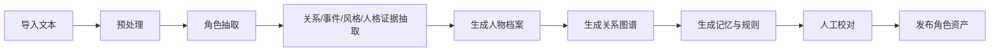

# CAMO

## 1. 概述

CAMO（Character Modeling & Simulation Base） 是一套面向非结构化文本的人物理解与角色驱动基座。其核心目标，不是直接提供单一玩法，而是将小说、聊天记录、剧本、访谈等文本输入，转化为可复用、可调用、可持续运行的角色资产，包括人物画像、人格结构、关系图谱、记忆体系、语言风格与角色扮演约束，并为上层应用提供统一的人物运行能力。

CAMO 的产品价值在于：把“文本中的人物”转化为“可交互、可模拟、可保持一致性的人物系统”。

CAMO 不是最终消费型应用，而是面向角色类应用的基础能力平台。

## 2. 目标

### 2.1 总体目标

构建一个通用的人物建模与仿真基座，使系统能够：

- 从文本中自动抽取人物
- 生成结构化人物画像
- 构建人物关系图谱
- 提炼语言风格与行为规则
- 形成可供交互调用的角色资产
- 在单聊、群聊、模拟场景中驱动角色稳定输出

### 2.2 阶段目标

#### 2.2.1 第一阶段目标

实现人物理解引擎，完成基础人物资产生成：

- 文本导入
- 角色抽取
- 人物画像生成
- 关系图谱生成
- 证据片段回溯

#### 2.2.2 第二阶段目标

实现角色驱动引擎，完成基础扮演能力：

- 单角色可扮演
- 角色记忆读取
- 风格约束输出
- 一致性校验

#### 2.2.3 第三阶段目标

实现多角色仿真能力：

- 群聊编排
- 指定角色互相对话
- 多角色场景状态维护
- 关系驱动发言与互动

## 3. 目标用户

### 3.1 直接用户

直接用户指使用 CAMO 基座进行配置、管理、调用的用户群体：

- 上层应用产品经理
- AI 应用开发者
- 角色互动类产品团队
- IP 互动内容团队
- 游戏与叙事系统设计人员
- 社交模拟类产品研发团队

### 3.2 间接用户

间接用户指最终消费 CAMO 能力的终端用户：

- 小说 / 动漫 / 影视 IP 爱好者
- 角色聊天与角色扮演用户
- AI 伴侣用户
- 互动叙事与模拟世界玩家
- 社交模拟、博弈类玩法用户

## 4. 核心场景

### 4.1 文本人物建模场景

输入一部小说、剧本或聊天记录，系统自动输出：

- 人物名单
- 人物画像
- 关系图谱
- 关键事件
- 代表性语料
- 扮演规则

### 4.2 单角色对话场景

用户选择某一人物，与其单独对话。

角色输出需要符合：

- 其身份
- 其性格
- 其知识边界
- 其语言风格
- 其与用户当前关系状态

### 4.3 多角色群聊场景

用户将多个角色拉入同一对话空间，执行以下交互：

- @指定角色发言
- 指定 A 与 B 对话
- 允许系统决定是否有人插话
- 维持角色之间的既有关系逻辑

### 4.4 社交模拟 / 博弈场景

系统在规则框架下，让多角色持续互动：

- 保留角色动机与偏好
- 根据关系图谱做行为决策
- 根据事件发展更新局部状态

## 5. 功能架构图

```mermaid
flowchart LR
    %% ===== System External: Input =====
    subgraph EXIN["系统外部：输入来源"]
        direction TB
        A1["原始文本输入<br/>小说 / 聊天记录 / 剧本 / 访谈"]
    end

    %% ===== System Boundary =====
    subgraph CAMO["CAMO 系统边界"]
        direction LR

        %% Processing Domain
        subgraph P["处理域 Processing Layer"]
            direction TB
            B["预处理层<br/>清洗 / 分段 / 别名归一 / 指代消解"]

            subgraph X["抽取与分析模块"]
                direction TB
                C1["角色抽取"]
                C2["关系抽取"]
                C3["事件抽取"]
                C4["语言风格抽取"]
                C5["人格证据抽取"]
            end

            D["人物建模引擎<br/>Character Modeling Engine"]
        end

        %% Asset Domain
        subgraph S["资产域 Asset Layer"]
            direction TB
            E1["角色档案库<br/>Character Profiles"]
            E2["关系图谱库<br/>Relationship Graph"]
            E3["记忆库<br/>Memory Store"]
            E4["扮演规则库<br/>Role Rules"]
        end

        %% Runtime Domain
        subgraph R["运行时 Runtime Layer"]
            direction TB
            F["角色运行时<br/>Character Runtime"]
        end
    end

    %% ===== System External: Output =====
    subgraph EXOUT["系统外部：输出 / 消费"]
        direction TB
        G1["上层应用接口<br/>API / SDK / Service"]
        G2["应用形态<br/>角色聊天 / 群聊 / 社交模拟 / 狼人杀 / 模拟世界"]
    end

    %% ===== Connections =====
    A1 --> B
    B --> C1
    B --> C2
    B --> C3
    B --> C4
    B --> C5

    C1 --> D
    C2 --> D
    C3 --> D
    C4 --> D
    C5 --> D

    D --> E1
    D --> E2
    D --> E3
    D --> E4

    E1 --> F
    E2 --> F
    E3 --> F
    E4 --> F

    F --> G1
    G1 --> G2

    %% ===== Styles =====
    style EXIN fill:#F6F8FA,stroke:#B8C0CC,stroke-width:1px,color:#1F2937
    style EXOUT fill:#F6F8FA,stroke:#B8C0CC,stroke-width:1px,color:#1F2937

    style CAMO fill:#FDFDFD,stroke:#2563EB,stroke-width:2px,color:#111827

    style P fill:#EFF6FF,stroke:#60A5FA,stroke-width:1.5px,color:#111827
    style X fill:#DBEAFE,stroke:#60A5FA,stroke-width:1px,color:#111827
    style S fill:#ECFDF5,stroke:#34D399,stroke-width:1.5px,color:#111827
    style R fill:#FFF7ED,stroke:#FB923C,stroke-width:1.5px,color:#111827

    style A1 fill:#FFFFFF,stroke:#9CA3AF,stroke-width:1px,color:#111827

    style B fill:#FFFFFF,stroke:#60A5FA,stroke-width:1px,color:#111827
    style C1 fill:#FFFFFF,stroke:#60A5FA,stroke-width:1px,color:#111827
    style C2 fill:#FFFFFF,stroke:#60A5FA,stroke-width:1px,color:#111827
    style C3 fill:#FFFFFF,stroke:#60A5FA,stroke-width:1px,color:#111827
    style C4 fill:#FFFFFF,stroke:#60A5FA,stroke-width:1px,color:#111827
    style C5 fill:#FFFFFF,stroke:#60A5FA,stroke-width:1px,color:#111827
    style D fill:#FFFFFF,stroke:#2563EB,stroke-width:2px,color:#111827

    style E1 fill:#FFFFFF,stroke:#34D399,stroke-width:1px,color:#111827
    style E2 fill:#FFFFFF,stroke:#34D399,stroke-width:1px,color:#111827
    style E3 fill:#FFFFFF,stroke:#34D399,stroke-width:1px,color:#111827
    style E4 fill:#FFFFFF,stroke:#34D399,stroke-width:1px,color:#111827

    style F fill:#FFFFFF,stroke:#FB923C,stroke-width:2px,color:#111827

    style G1 fill:#FFFFFF,stroke:#9CA3AF,stroke-width:1px,color:#111827
    style G2 fill:#FFFFFF,stroke:#9CA3AF,stroke-width:1px,color:#111827
```



## 6. 功能需求

### 6.1 文本输入模块

#### 6.1.1 功能目标

接收外部文本，并完成进入建模流程前的标准化处理。

#### 6.1.2 输入类型

- 长篇小说
- 分章节文本
- 聊天记录
- 剧本 / 台词本
- 人物设定文档
- 访谈记录
- wiki 资料

#### 6.1.3 功能要求

- 支持粘贴文本、文件上传、分段导入
- 支持按章节、按回合、按消息顺序保存原始内容
- 支持角色别名归一化配置
- 支持文本清洗，如去噪、去格式符、异常分段修复
- 保留原文索引，供证据回溯使用

#### 6.1.4 输出

- 结构化文本片段
- 原文索引
- 章节 / 回合 / 时间序列信息

### 6.2 人物建模与设计

人物建模分成三个层级：entity index、entity core、entity facet

- Index，回答这是谁
- Core ，回答这个人核心上怎么运作
- Facet，回答为什么这么判断、细节是什么、来源维度上还有什么补充

#### 6.2.1 Entity index

##### 6.2.1.1 功能目标

识别文本中涉及的人物实体，并形成统一角色列表，以供索引。

##### 6.2.1.2 功能要求

- 抽取人物名称、别名、称谓、身份标签
- 合并同一人物的不同称呼
- 输出角色清单，支持人工校正

##### 6.2.1.3 输出字段

- character_id：系统内部角色的唯一标识（Primary Key）
- character_type：枚举值，说明角色的类型。类型有：
- fictional_person，小说人物
- real_person，真人
- group_persona，群像
- virtual_persona，虚拟人物
- unknown_person，未知人物
- name：角色主名称（Canonical Name）
- description：描述
- aliases：同一角色的别名 / 指代 / 昵称，可能有多个
- titles：身份性称谓（Title / Honorific）
- identities：系统建模的身份，枚举值，具体可能有哪些值待明确@Means。和titles的区别：titles是角色在文本语境中的身份称谓。而identities是系统给予的身份称谓，是系统语境的身份称谓。

##### 6.2.1.4 示例

```json
{
  "character_id": "yue_buqun",
  "character_type": "fictional_person",
  "name": "岳不群",
  "description": "外表儒雅克制、重名望与秩序，擅长隐藏真实意图的华山派掌门。",
  "aliases": [
    "岳掌门",
    "君子剑"
  ],
  "titles": [
    "岳掌门",
    "君子剑",
    "师父"
  ],
  "identities": [
    {
      "type": "organizational_role",
      "value": "sect_leader"
    },
    {
      "type": "relationship_role",
      "value": "mentor"
    }
  ]
}
```

#### 6.2.2 Entity core

##### 6.2.2.1 功能目标

基于文本中的行为、语言、关系和事件，生成人物结构化画像。

##### 6.2.2.2 建模层次

- 基础身份
- Big Five 人格维度：Big Five 是目前心理学最主流的人格结构模型之一，用连续维度描述稳定人格倾向。
- 核心动机：来源于Self-Determination Theory（自我决定理论）
- 价值观与禁忌：来源于Schwartz Value Theory（施瓦茨价值观模型）
- 行为策略：来源于BDI 模型（Belief-Desire-Intention）
- 语言风格：来源于Sociolinguistics（社会语言学），可为后续加入人物配音提供支撑
- 边界和约束：说明角色的知识范围和运行时约束

##### 6.2.2.3 输出字段

- character_id：角色唯一标识
- trait_profile：人格特征，根据Big Five的5个维度给出分值
- motivation_profile：动机结构，分为主/次/抑制
- value_profile：价值排序（冲突决策依据）
- behavior_profile：行为模式（决策与冲突方式）
- communication_profile：沟通风格
- constraint_profile：运行约束，知识边界与一致性

##### 6.2.2.4 字段详细说明

###### 6.2.2.4.1 trait_profile

字段结构

```text
{
  "openness": ,
  "conscientiousness": ,
  "extraversion": ,
  "agreeableness": ,
  "neuroticism":
}
```

取值范围

| 值 | 含义 |
| --- | --- |
| 1 | 极低 |
| 2 | 偏低 |
| 3 | 中等 |
| 4 | 偏高 |
| 5 | 极高 |

###### 6.2.2.4.2 motivation_profile

字段结构

```json
{
  "primary": [
    "power",
    "status"
  ],
  "secondary": [
    "order"
  ],
  "suppressed": [
    "altruism"
  ]
}
```

取值范围：

| 值 | 含义 |
| --- | --- |
| power | 权力/控制 |
| status | 名望/地位 |
| wealth | 财富 |
| survival | 生存/安全 |
| affiliation | 关系/归属 |
| altruism | 利他/帮助他人 |
| curiosity | 好奇/探索 |
| mastery | 精进/能力 |
| freedom | 自主/自由 |
| revenge | 复仇 |
| order | 秩序/稳定 |
| pleasure | 享乐 |

规则

- primary：最多 2 个
- secondary：最多 3 个
- suppressed：可选

###### 6.2.2.4.3 value_profile

结构（排序列表）

```json
{
  "ranking": [
    "order",
    "status",
    "loyalty",
    "truth"
  ]
}
```

取值范围

| 值 | 含义 |
| --- | --- |
| truth | 真相 |
| order | 秩序 |
| freedom | 自由 |
| loyalty | 忠诚 |
| fairness | 公平 |
| power | 权力 |
| survival | 生存 |
| honor | 荣誉 |
| benevolence | 善意 |
| efficiency | 效率 |

规则

- 必须排序（从高到低）
- 最少 3 个，最多 6 个

###### 6.2.2.4.4 behavior_profile

结构

```json
{
  "conflict_style": "indirect_control",
  "risk_preference": "medium_low",
  "decision_style": "deliberate",
  "dominance_style": "hierarchical"
}
```

取值范围

conflict_style（冲突处理）

- `avoidant`
- `direct_confrontation`
- `indirect_control`
- `manipulative`
- `compliant`

risk_preference（风险偏好）

- `low`
- `medium_low`
- `medium`
- `medium_high`
- `high`

decision_style（决策方式）

- `impulsive`
- `emotional`
- `deliberate`
- `strategic`

dominance_style（权力风格）

- `egalitarian`
- `hierarchical`
- `authoritative`
- `covert_control`

###### 6.2.2.4.5 communication_profile（沟通风格）

结构

```json
{
  "tone": "formal",
  "directness": "low",
  "emotional_expressiveness": "low",
  "verbosity": "medium",
  "politeness": "high"
}
```

取值范围

tone

- `formal`
- `neutral`
- `casual`
- `aggressive`

directness

- `low`
- `medium`
- `high`

emotional_expressiveness

- `low`
- `medium`
- `high`

verbosity

- `low`
- `medium`
- `high`

politeness

- `low`
- `medium`
- `high`

###### 6.2.2.4.6 constraint_profile（约束）

结构

```json
{
  "knowledge_scope": "bounded",
  "role_consistency": "strict",
  "forbidden_behaviors": [
    "break_character",
    "meta_knowledge"
  ]
}
```

取值范围

knowledge_scope

- `strict`
- `bounded`
- `open`

role_consistency

- `strict`
- `medium`
- `loose`

forbidden_behaviors（可多选）

- `break_character`
- `meta_knowledge`
- `modern_slang`
- `out_of_setting`

##### 6.2.2.5 示例

```json
{
  "character_id": "yue_buqun",
  "trait_profile": {
    "openness": 2,
    "conscientiousness": 5,
    "extraversion": 2,
    "agreeableness": 2,
    "neuroticism": 3
  },
  "motivation_profile": {
    "primary": [
      "power",
      "status"
    ],
    "secondary": [
      "order"
    ],
    "suppressed": [
      "altruism"
    ]
  },
  "value_profile": {
    "ranking": [
      "order",
      "status",
      "loyalty",
      "truth"
    ]
  },
  "behavior_profile": {
    "conflict_style": "indirect_control",
    "risk_preference": "medium_low",
    "decision_style": "strategic",
    "dominance_style": "hierarchical"
  },
  "communication_profile": {
    "tone": "formal",
    "directness": "low",
    "emotional_expressiveness": "low",
    "verbosity": "medium",
    "politeness": "high"
  },
  "constraint_profile": {
    "knowledge_scope": "bounded",
    "role_consistency": "strict",
    "forbidden_behaviors": [
      "break_character",
      "meta_knowledge"
    ]
  }
}
```

#### 6.2.3 Entity facet--未梳理

### 6.3 关系图谱模块--未梳理

#### 6.3.1 功能目标

构建角色之间的关系网络，为对话和仿真提供关系依据。

#### 6.3.2 关系类型示例

- 师徒
- 亲属
- 爱慕
- 依附
- 利用
- 对立
- 仇恨
- 敬畏
- 结盟

#### 6.3.3 功能要求

- 关系支持方向性
- 关系支持强度分值
- 支持公开关系与隐含关系分离
- 支持记录关系变化线索
- 每条关系必须可回溯原文证据
- 支持图谱可视化展示

### 6.4 事件与记忆模块--未梳理

#### 6.4.1 功能目标

从文本中抽取关键事件，并将其转化为角色可调用的记忆资源。

#### 6.4.2 记忆分类

- 设定记忆 Profile Memory
- 关系记忆 Relationship Memory
- 事件记忆 Episodic Memory
- 工作记忆 Working Memory

#### 6.4.3 功能要求

- 为角色建立关键事件清单
- 标记事件对角色的情绪权重
- 支持检索与当前对话相关的记忆
- 支持记忆按重要性排序
- 支持上层应用写入新事件，形成动态扩展

### 6.5 角色运行时模块--未梳理

#### 6.5.1 功能目标

在上层应用调用角色时，根据当前上下文动态生成角色回复。

#### 6.5.2 功能要求

- 支持单角色运行
- 支持多角色运行
- 根据当前场景加载人物档案、关系、记忆、风格约束
- 控制角色不越过其知识边界
- 支持指定响应角色
- 支持未来扩展自动发言和插话策略

#### 6.5.3 输入

- 当前场景
- 当前参与角色
- 当前问题
- 近期会话
- 角色运行规则

#### 6.5.4 输出

- 角色回复
- 角色内部推理状态摘要
- 触发的记忆与规则引用

### 6.6 一致性校验模块--未梳理

#### 6.6.1 功能目标

对角色输出进行二次校验，降低 OOC、穿帮、越权输出。

#### 6.6.2 功能要求

- 检查是否偏离角色设定
- 检查是否使用不合时代或不合身份的话术
- 检查是否说出了角色不该知道的信息
- 检查是否与既有关系逻辑冲突
- 支持返回修正建议或重新生成

#### 6.6.3 校验维度

- 人设一致性
- 关系一致性
- 时间线一致性
- 语体一致性
- 知识边界一致性

### 6.7 对外接口模块--未梳理

#### 6.7.1 功能目标

为上层应用提供统一调用方式。

#### 6.7.2 对外能力

- 创建文本项目
- 导入文本并触发建模
- 查询角色清单
- 查询人物档案
- 查询关系图谱
- 查询记忆
- 调用角色对话
- 调用多角色场景运行
- 获取一致性校验结果

## 7. 关键流程

### 7.1 建模流程



### 7.2 角色对话流程


## 8. 技术方案

待完善
