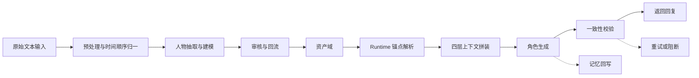
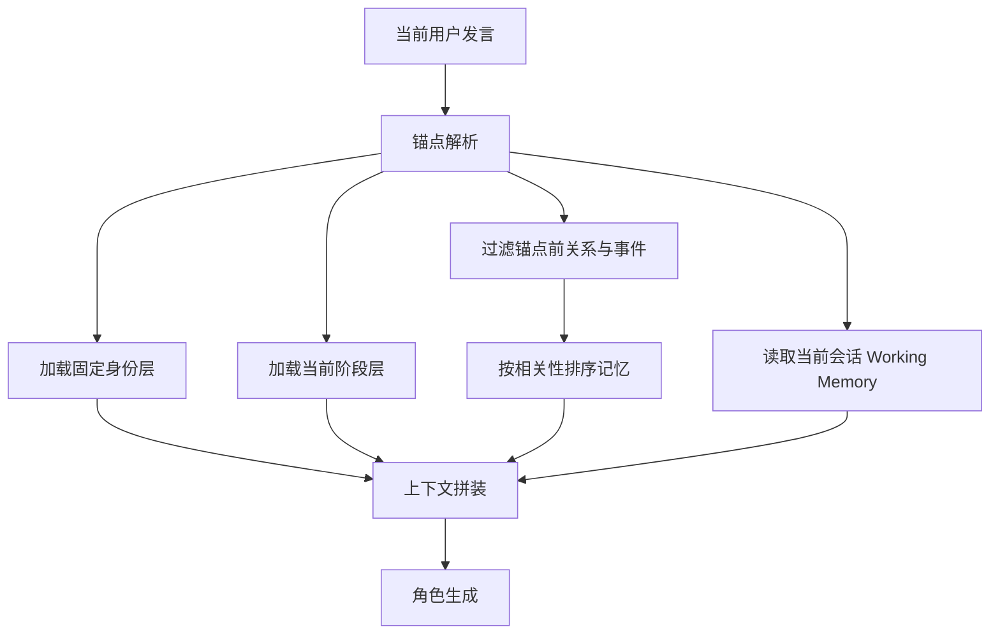
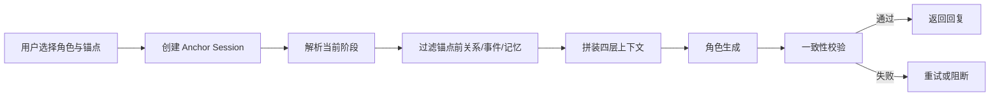

# CAMO 产品方案 v0.3

> 本版本基于 v0.2 更新，重点解决角色聊天中的两个核心问题：`角色当前处于哪一段时间线`，以及`角色在该时点知道什么、不知道什么`。v0.3 将第二阶段的“可扮演”升级为“可定位、可约束、可解释”的角色运行能力。

## 1. 概述

### 1.1 产品定义

CAMO 是一套面向非结构化文本的人物理解与角色驱动基座。它将小说、聊天记录、剧本、访谈、wiki 等文本输入，转化为可复用、可调用、可持续运行的角色资产，包括人物画像、关系图谱、事件、记忆、语言风格与运行约束，并为上层应用提供统一的人物运行能力。

### 1.2 v0.3 更新重点

相比 v0.2，本版本新增并明确以下产品能力：

- 引入 `时间锚点（Time Anchor）`，每次角色聊天都必须绑定明确时点
- 采用四层运行时上下文拼装：
  - 固定身份层
  - 当前阶段层
  - 截止前记忆层
  - 拒答规则层
- 将“时间线一致性”和“知识边界一致性”从泛要求升级为显式产品能力
- 明确“锚点切换 = 新会话”，避免不同阶段对话记忆串线
- 聊天界面必须持续展示当前角色所处时点与阶段摘要，降低用户理解成本

### 1.3 产品边界（不做什么）

为避免范围蔓延，本版本继续保持以下边界：

- 不做最终消费型聊天产品，CAMO 仍是基座能力
- 不做平台级通用内容审核，只做角色一致性与边界约束
- 不做模型训练与微调，继续采用“结构化资产 + Runtime 编排”路线
- 不做非人物实体的完整结构化世界建模，组织、地点、物品仍只作为人物上下文出现
- 不做跨项目人物融合与知识共享
- 不做“无时点”的原作角色聊天，原作角色对话必须绑定明确锚点

## 2. 目标

### 2.1 总体目标

构建一套可从文本中抽取人物、并在指定时间线位置上稳定驱动角色输出的基座，使系统能够：

- 从原始文本中自动抽取人物与关系
- 为人物生成结构化画像与阶段性快照
- 构建带时间顺序的事件与记忆体系
- 在明确时间锚点下驱动单角色或多角色输出
- 控制角色不越过其时代、设定与剧情时点的知识边界
- 向上层应用暴露可解释、可调试、可评测的运行结果

### 2.2 阶段目标与验收指标

#### 2.2.1 第一阶段：人物理解引擎

**功能范围**

- 文本导入
- 角色抽取
- 人物画像生成（Character Index + Core + Facet）
- 关系图谱生成
- 时间顺序归一
- 阶段性快照抽取
- 证据片段回溯

**验收指标**

| 指标 | 目标 |
| --- | --- |
| 主要角色召回率 | ≥ 90% |
| 角色别名归一准确率 | ≥ 95% |
| 人物画像人工评审通过率 | ≥ 80% |
| 主要关系召回率 | ≥ 85% |
| 时间顺序人工抽检正确率 | ≥ 90% |
| 证据回溯覆盖率 | 100% |

#### 2.2.2 第二阶段：角色驱动引擎

**功能范围**

- 单角色可扮演
- 基于时间锚点的角色定位
- 角色知识边界控制
- 阶段快照加载
- 截止前记忆检索
- 一致性校验
- 锚点切换与会话隔离

**验收指标**

| 指标 | 目标 |
| --- | --- |
| 单轮对话人设一致性人评 | ≥ 4 / 5 |
| 时间线定位可理解性人评 | ≥ 4 / 5 |
| 知识边界命中率（不越界输出比例） | ≥ 95% |
| 锚点切换后记忆串线率 | 0 个严重问题 |
| 越界问题角色式拒答合理性人评 | ≥ 85% |
| 一致性校验误杀率 | ≤ 5% |
| 一致性校验漏报率 | ≤ 10% |

#### 2.2.3 第三阶段：多角色仿真

**功能范围**

- 多角色群聊
- 场景状态维护
- 信息不对称控制
- 多角色各自时间锚点与可见性控制
- 关系驱动发言与互动

**验收指标**

| 指标 | 目标 |
| --- | --- |
| 多轮对话中每轮角色一致性人评 | ≥ 4 / 5 |
| 关系驱动发言合理性人评 | ≥ 80% |
| 多角色场景状态维护正确率 | ≥ 85% |
| 信息不对称规则遵守率 | ≥ 95% |

## 3. 术语表

| 术语 | 定义 |
| --- | --- |
| Character | 被 CAMO 建模的人物，拥有唯一 `character_id` |
| Character Index | 人物索引层，回答“这是谁” |
| Character Core | 人物核心层，回答“这个人是怎么运作的” |
| Character Facet | 人物细节层，回答“为什么这么判断，以及有哪些阶段差异” |
| Relationship | 两个 Character 之间的关系边，可带时间变化 |
| Event | 客观发生过的事件，带时间顺序 |
| Memory | 某个角色对事件、关系或自身设定的记忆承载 |
| Working Memory | 当前会话内的短期对话记忆，属于 Memory 的运行时子类 |
| Time Anchor | 角色本次会话所处的明确时间锚点，决定其当前知道什么 |
| Runtime Anchor | Time Anchor 在运行时中的结构化表示，用于解析与展示 |
| Temporal Snapshot | 人物在某一阶段的快照，描述该阶段的状态、认知范围和画像覆写 |
| Anchor Session | 与单一时间锚点绑定的会话。一个会话只允许一个锚点 |
| Knowledge Boundary | 角色在当前时点下可知信息的边界，包含时代、剧情、设定和项目范围 |
| Constraint Profile | Character Core 中描述知识边界、禁说规则与角色一致性约束的结构 |
| Fixed Identity Layer | 角色稳定身份层，描述其长期不轻易变化的自我 |
| Current Stage Layer | 当前阶段层，描述角色在此时此刻的处境、认知与阶段性变化 |
| Pre-cutoff Memory Layer | 截止点之前、且与当前问题相关的记忆层 |
| Refusal Rule Layer | 角色遇到未来剧情、后世概念或原作外设定时的处理规则层 |

## 4. 核心场景

### 4.1 文本人物建模场景

输入一部小说、聊天记录、剧本或访谈，系统输出：

- 人物名单
- 角色画像（Index / Core / Facet）
- 关系图谱
- 关键事件
- 时间顺序索引
- 阶段性快照
- 证据引用

### 4.2 单角色锚点聊天场景

用户选择一个角色，并明确选择某个时点与其对话。系统需要保证：

- 角色身份稳定
- 当前阶段明确
- 只使用该时点之前的事件、关系和记忆
- 遇到未来剧情或时代外知识时，以角色口吻拒答或保守回应
- 聊天界面持续展示当前锚点和阶段摘要

### 4.3 锚点切换场景

用户在与同一角色对话过程中，希望切换到另一个时点，例如：

- 令狐冲“第 300 页前”
- 令狐冲“结局后”
- 某聊天记录角色“2026-04-11 前”

系统需要保证：

- 切换后进入新会话
- 旧会话的 Working Memory 不被带入新时点
- 当前显示信息同步切换

### 4.4 越界问题场景

用户向角色提出超出其知识边界的问题，例如：

- 民国人物被问互联网
- 爱因斯坦被问中华人民共和国
- 角色在前期时点下被问结局真相
- 小说角色被问原作之外的设定补完

系统默认不使用系统口吻硬拦截，而是让角色以自身身份合理回应“不知道”“未曾听闻”“此事尚未到我面前”。

### 4.5 内容创作反向校验场景

作者上传设定集、章节或大纲，系统不仅输出人物画像，还输出：

- 哪些阶段切换清晰
- 哪些时点边界模糊
- 哪些阶段快照缺失
- 哪些角色在不同阶段出现了明显画像漂移

## 5. 关键产品决策

本版本锁定以下默认规则：

1. **原作角色聊天必须有锚点**

   - 不支持“整合全书、不分时点”的默认模式
   - 若无锚点，不进入正式聊天

2. **锚点采用混合模式**

   - 底层以页数、章节、消息时间戳、消息序号等原始进度定位
   - 前台同时展示系统整理出的阶段名与摘要

3. **越界问题采用角色式拒答**

   - 默认不直接输出系统提示语
   - 只有在需要解释时，前台可附带轻量辅助说明

4. **锚点切换等同于切换世界线**

   - 必须开启新会话
   - Working Memory 不跨锚点复用

5. **阶段快照优先于全局画像**

   - 当阶段快照与全局画像冲突时，以当前阶段快照为准
   - 全局画像用于提供稳定身份与长期底色

6. **当前锚点必须明确展示**

   - 聊天界面需常驻显示当前阶段卡片
   - 内容至少包含：截止点、阶段名、阶段摘要

## 6. 功能架构

### 6.1 架构图



### 6.2 分层职责与上下游接口

| 层 | 核心职责 | 主要上游 | 主要下游 |
| --- | --- | --- | --- |
| 输入层 | 接收与标准化原始文本，生成统一时间顺序 | 外部调用方 | 处理域 |
| 处理域 | 预处理、抽取、建模、阶段快照生成 | 输入层 | 审核域 |
| 审核域 | 修正角色画像、阶段快照、默认锚点、知识边界 | 处理域 / 运行时反馈 | 资产域 |
| 资产域 | 存储角色、关系、事件、记忆、快照与版本 | 审核域 / 运行时 | Runtime / API |
| Runtime | 解析锚点，拼装四层上下文，生成与校验角色输出 | 资产域 | API |
| API / SDK | 对上层应用提供统一能力与调试信息 | 资产域 / Runtime | 上层应用 |

### 6.3 Runtime 四层拼装

Runtime 在产品层被定义为四个必备层：

| 层 | 目标 | 主要来源 |
| --- | --- | --- |
| 固定身份层 | 锁定角色长期稳定身份、口吻、核心约束 | Character Index + Character Core + Character Facet.biographical_notes |
| 当前阶段层 | 锁定角色当前处于哪一段人生、知道什么、不知道什么 | Runtime Anchor + Temporal Snapshot（来自 Character Facet.temporal_snapshots） |
| 截止前记忆层 | 提供与当前问题相关、且发生在锚点之前的记忆 | Relationship + Event + Memory（含 Working Memory） |
| 拒答规则层 | 规范越界提问时的回答方式 | Constraint Profile + Runtime refusal policy |

说明：

- `Character Facet` 不属于单一一层，而是按字段拆分进入 Runtime：
  - `biographical_notes` 进入固定身份层
  - `temporal_snapshots` 进入当前阶段层
  - `evidence_map` 默认不直接进入主生成上下文，主要服务于审核、调试、解释和一致性校验
- 本表中的“主要来源”术语与第 3 章术语表保持一一对应；若实现层出现内部对象名，应在技术文档中说明其与产品术语的映射关系。

## 7. 数据模型总览

### 7.1 总览

v0.3 延续 v0.2 的核心资产结构，但新增两个关键产品概念：

- `Temporal Snapshot`：角色在不同阶段的状态快照
- `Runtime Anchor`：会话创建时指定的时间锚点

### 7.2 统一时间轴

所有输入类型都需要被归一到单一时间轴上，以支持统一检索和过滤：

- 小说类：章节 / 页码 / segment 顺序
- 聊天类：时间戳 / 消息序号
- 剧本类：幕次 / 场次 / 发言顺序
- 访谈类：时间戳 / 段落顺序

对 Runtime 而言，最终使用的是统一的 `timeline_pos` 绝对顺序。原始进度信息用于：

- 锚点选择
- 前台展示
- 审核修正
- 调试与解释

### 7.3 Temporal Snapshot 结构

`temporal_snapshots` 不再只是展示性附录，而是 Runtime 的正式输入。

| 字段 | 说明 |
| --- | --- |
| `snapshot_id` | 快照唯一标识 |
| `period_label` | 阶段名称 |
| `activation_range` | 生效时间范围，基于统一时间轴 |
| `display_hint` | 给用户看的阶段提示，如“第 300 页前” |
| `stage_summary` | 当前阶段摘要 |
| `known_facts` | 角色在此阶段明确知道的关键信息 |
| `unknown_facts` | 角色在此阶段明确不知道或尚未确认的信息 |
| `profile_overrides` | 对全局画像的阶段性覆写 |
| `notes` | 补充说明 |

示例：

```json
{
  "snapshot_id": "snap_linghu_0300",
  "period_label": "少林前夜",
  "activation_range": {
    "start_timeline_pos": 240,
    "end_timeline_pos": 300
  },
  "display_hint": {
    "primary": "第 300 页前",
    "secondary": "尚未得知最终真相"
  },
  "stage_summary": "令狐冲已历多次江湖风波，但尚未抵达故事最终局面，对若干真相并不知情。",
  "known_facts": ["与任盈盈关系已明显加深"],
  "unknown_facts": ["结局后的门派归宿", "最终权力格局"],
  "profile_overrides": {
    "behavior_profile": {
      "risk_preference": "medium_high"
    }
  },
  "notes": "此阶段更适合处理半公开关系与未定局势。"
}
```

### 7.4 Runtime Anchor 结构

每个正式聊天会话必须绑定一个 `Runtime Anchor`：

| 字段 | 说明 |
| --- | --- |
| `anchor_mode` | `source_progress` 或 `snapshot` |
| `source_type` | `chapter` / `page` / `timestamp` / `message_index` / `timeline_pos` |
| `cutoff_value` | 原始进度值 |
| `resolved_timeline_pos` | Runtime 实际使用的时间轴截止点 |
| `snapshot_id` | 命中的阶段快照 |
| `display_label` | 面向用户的锚点标题 |
| `summary` | 面向用户的简短摘要 |

示例：

```json
{
  "anchor_mode": "source_progress",
  "source_type": "page",
  "cutoff_value": 300,
  "resolved_timeline_pos": 1842,
  "snapshot_id": "snap_linghu_0300",
  "display_label": "第 300 页前",
  "summary": "当前角色仍处于中后期，但尚未经历结局事件。"
}
```

## 8. 功能需求

### 8.1 文本输入模块

#### 8.1.1 功能目标

对原始文本进行标准化处理，并为后续建模和 Runtime 提供可解释的时间顺序基础。

#### 8.1.2 功能要求

- 识别输入类型：小说、聊天记录、剧本、访谈、plain text
- 为每个 segment 生成统一时间顺序 `timeline_pos`
- 保留原始进度信息（如页码、章节、时间戳、消息序号）
- 在可能的情况下自动生成候选锚点
- 对时间顺序含糊的源文本提供人工修正入口

### 8.2 人物建模模块

#### 8.2.1 功能目标

输出角色稳定身份、阶段变化和运行约束。

#### 8.2.2 功能要求

- 保留 Character Index / Core / Facet 三层结构
- `constraint_profile` 必须明确知识边界与越界行为
- `temporal_snapshots` 成为正式运行资产，不再只是附加说明
- 支持人工审核角色默认锚点与阶段命名

#### 8.2.3 constraint_profile 扩展要求

`constraint_profile` 继续作为 Runtime 约束来源，但在 v0.3 中必须能覆盖以下几类规则：

| namespace | 示例 tag | 含义 |
| --- | --- | --- |
| `meta` | `break_character` | 不得跳出扮演 |
| `meta` | `meta_knowledge` | 不得以作品外上帝视角回答 |
| `setting` | `out_of_setting` | 不得引入时代外概念 |
| `setting` | `anachronism` | 不得说出不合时宜的事物 |
| `plot` | `future_spoiler` | 不得泄露当前锚点之后的剧情 |
| `custom` | `avoid_reveal_secret` | 项目自定义的禁说规则 |

### 8.3 关系图谱模块

#### 8.3.1 功能目标

构建带时间变化的关系网络，为不同锚点下的角色态度提供依据。

#### 8.3.2 功能要求

- 关系边支持公开状态、隐含状态和时间线变化
- Runtime 读取关系时，只加载当前锚点之前的关系状态
- 阶段快照可对关系表现做临时覆写

### 8.4 事件与记忆模块

#### 8.4.1 功能目标

从文本中抽取可排序事件，并将其转化为角色可调用记忆。

#### 8.4.2 记忆分类

CAMO 将角色记忆分为四类：

| 类型 | 描述 | 主要来源 |
| --- | --- | --- |
| Profile Memory | 长期稳定设定 | Character Core / Facet |
| Relationship Memory | 对其他角色的关系记忆 | Relationship / Event |
| Episodic Memory | 具体经历过的事件记忆 | Event |
| Working Memory | 当前锚点会话内的短期对话记忆 | Runtime 会话 |

#### 8.4.3 功能要求

- 所有事件都必须可落到统一时间轴
- 记忆检索必须先按锚点过滤，再按相关性排序
- Working Memory 只属于单一锚点会话
- Runtime 回写的新记忆默认继承当前会话锚点之后的可见性规则

#### 8.4.4 记忆检索流程



### 8.5 角色运行时模块

#### 8.5.1 功能目标

在明确锚点下，根据人物资产、阶段快照、记忆和约束生成角色回复，并形成校验与回写闭环。

#### 8.5.2 功能要求

- 单角色聊天必须绑定锚点
- 支持显式指定锚点或通过快照选择锚点
- 采用四层上下文拼装
- 控制角色不越过知识边界
- 支持锚点状态对外展示
- 支持调试模式输出检索与规则命中轨迹

#### 8.5.3 输入结构

```json
{
  "session_id": "sess_0001",
  "project_id": "proj_xiaoao",
  "scene": {
    "scene_id": "scn_0003",
    "scene_type": "single_chat",
    "description": "用户与岳不群在思过崖上的私下谈话",
    "rules": {
      "turn_based": false,
      "visibility": "full"
    },
    "anchor": {
      "anchor_mode": "source_progress",
      "source_type": "page",
      "cutoff_value": 300
    }
  },
  "participants": ["yue_buqun"],
  "speaker_target": "yue_buqun",
  "user_input": {
    "speaker": "user",
    "content": "师父，您真的未曾动过夺取剑谱的念头吗？"
  },
  "recent_history": [
    { "speaker": "user", "content": "..." },
    { "speaker": "yue_buqun", "content": "..." }
  ],
  "runtime_options": {
    "include_reasoning_summary": true,
    "debug": false
  }
}
```

#### 8.5.4 输出结构

```json
{
  "session_id": "sess_0001",
  "anchor_state": {
    "display_label": "第 300 页前",
    "summary": "岳不群处于中期阶段，仍以掌门身份维持体面与控制。",
    "snapshot_id": "snap_yue_0300"
  },
  "response": {
    "speaker": "yue_buqun",
    "content": "冲儿，为师所虑者从来都是华山一派的立身之本。至于你所问之事，此时又何必听那些捕风捉影的话。",
    "style_tags": ["formal", "guarded", "low_directness"]
  },
  "reasoning_summary": "当前锚点下角色尚不会公开承认真实欲望，应以掌门体面和回避策略作答。",
  "triggered_memories": [
    { "memory_id": "mem_0012", "reason": "与当前质问直接相关，且发生在锚点之前" }
  ],
  "applied_rules": [
    { "namespace": "plot", "tag": "future_spoiler" },
    { "namespace": "custom", "tag": "avoid_reveal_secret" }
  ],
  "consistency_check": {
    "passed": true,
    "issues": []
  }
}
```

#### 8.5.5 锚点切换规则

- 一个会话只能绑定一个锚点
- 锚点一旦变化，系统必须创建新会话
- 旧会话 Working Memory 不进入新会话
- 前台需刷新显示新的锚点卡片

#### 8.5.6 前台展示要求

聊天界面应常驻展示“当前阶段卡片”，至少包含：

- 截止点
- 阶段名
- 简短摘要
- 可选的“我知道 / 我不知道”提示

### 8.6 一致性校验模块

#### 8.6.1 功能目标

对角色输出进行二次校验，降低 OOC、穿帮、剧透和时代错位。

#### 8.6.2 校验维度

| 维度 | 描述 | 示例 |
| --- | --- | --- |
| 人设一致性 | 与全局画像和阶段快照不冲突 | 极内向角色不应突然长篇激烈表白 |
| 关系一致性 | 与当前锚点前的关系状态一致 | 敌对对象不应被称作至交 |
| 时间线一致性 | 不出现锚点之后才可能知道的信息 | 前期角色不应知道结局真相 |
| 语体一致性 | 与 communication_profile 一致 | 古风角色不应大量使用现代网语 |
| 知识边界一致性 | 不越过设定、时代、作品范围 | 爱因斯坦不应解释后世国家建制 |
| 约束一致性 | 不违反 constraint_profile | 不承认自己是 AI，不泄露禁说信息 |

#### 8.6.3 功能要求

- 对每轮 Runtime 输出进行校验
- 支持规则引擎和 Judge LLM 联合判断
- 对严重问题支持自动重试
- 在调试模式下返回命中的规则与原因

### 8.7 审核与回流模块

#### 8.7.1 功能目标

让审核者不仅校正人物画像，也校正阶段边界、锚点命名和默认入口。

#### 8.7.2 功能要求

- 支持人工修正阶段快照
- 支持人工设置角色默认锚点
- 支持标记“适合公开展示的阶段名称”
- 支持回收运行时反馈，修正知识边界和拒答表现

### 8.8 对外接口模块

#### 8.8.1 功能目标

对上层应用提供统一的建模、锚点浏览、会话和调试接口。

#### 8.8.2 接口列表

| 模块 | 能力 | 路径 |
| --- | --- | --- |
| 角色资产 | 获取角色详情 | `GET /projects/{project_id}/characters/{character_id}` |
| 角色资产 | 获取阶段快照列表 | `GET /projects/{project_id}/characters/{character_id}/anchors` |
| Runtime | 创建会话 | `POST /runtime/sessions` |
| Runtime | 单次对话调用 | `POST /runtime/sessions/{session_id}/turns` |
| Runtime | 切换锚点并创建新会话 | `POST /runtime/sessions/{session_id}/switch-anchor` |
| Runtime | 结束会话 | `DELETE /runtime/sessions/{session_id}` |
| 审核 | 更新角色快照与默认锚点 | `PATCH /characters/{character_id}` |

## 9. 关键流程

### 9.1 建模流程


### 9.2 锚点聊天流程



### 9.3 锚点切换流程


## 10. 非功能需求

### 10.1 可理解性

- 用户必须能看懂当前角色在哪个时点
- 用户必须能理解为什么角色“不知道”某件事
- 调试模式必须能解释本轮加载了哪些记忆、命中了哪些规则

### 10.2 性能

- 单轮锚点解析与阶段解析不应成为主要延迟来源
- 会话创建时应在可接受时间内返回可用锚点状态
- 一致性校验重试次数应受控，避免体验明显拖慢

### 10.3 可扩展性

- 锚点机制要能兼容小说、聊天记录、剧本和访谈
- 多角色场景应复用同一锚点与快照模型
- 不同项目可扩展自定义 forbidden tags

### 10.4 可解释性

- 任何重要阶段快照都应可追溯到原文证据
- 任一越界拒答都应可解释为：时代外、剧情后、作品外或自定义禁说

## 11. 评测体系

### 11.1 评测目标

评测重点从“像不像这个人”扩展为“像不像这个人当前所处这个阶段的他”。

### 11.2 评测指标

| 指标 | 描述 |
| --- | --- |
| Anchor Resolution Accuracy | 锚点解析到正确阶段的比例 |
| Stage Awareness | 角色是否表现出与当前阶段一致的认知与态度 |
| Out-of-Scope Refusal Accuracy | 对越界问题是否进行了合理拒答 |
| Memory Leakage Rate | 是否引用了锚点之后的信息 |
| Anchor Switch Isolation | 锚点切换后是否发生会话串线 |

### 11.3 评测方式

- 人工评审：抽检不同阶段同一角色的回答差异
- 对照题集：构造未来剧情、时代外概念、作品外设定等问题
- 自动规则统计：检查回答中是否出现禁用概念或未来事件引用

## 12. 安全与合规

### 12.1 内容安全

CAMO 仍只负责角色一致性与边界约束，不替代平台级内容审核。

### 12.2 版权与数据合规

输入文本版权与授权由调用方保证。CAMO 仅对结构化结果与运行过程负责。

### 12.3 隐私保护

聊天记录类输入应支持按项目隔离、按会话过期和按需删除。

## 13. 迭代计划与里程碑

### 13.1 第一阶段：人物理解引擎

| 里程碑 | 内容 |
| --- | --- |
| M1.1 | 文本导入与统一时间顺序归一 |
| M1.2 | 角色索引与别名归一 |
| M1.3 | Core / Facet 抽取 |
| M1.4 | 事件与记忆抽取 |
| M1.5 | 阶段快照生成与审核 |
| M1.6 | 第一阶段验收 |

### 13.2 第二阶段：角色驱动引擎

| 里程碑 | 内容 |
| --- | --- |
| M2.1 | Anchor Session 与锚点解析 |
| M2.2 | 四层 Runtime 上下文拼装 |
| M2.3 | 锚点前记忆检索与过滤 |
| M2.4 | 越界拒答与一致性校验 |
| M2.5 | 锚点切换与会话隔离 |
| M2.6 | 调试输出与前台阶段卡片 |
| M2.7 | 第二阶段验收 |

### 13.3 第三阶段：多角色仿真

| 里程碑 | 内容 |
| --- | --- |
| M3.1 | 多角色锚点与可见性规则 |
| M3.2 | 多角色场景状态维护 |
| M3.3 | 信息不对称规则支持 |
| M3.4 | 多角色仿真评测 |
| M3.5 | 第三阶段验收 |
