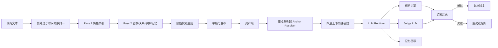

# CAMO 技术设计文档 v0.2

> 本文档基于 `CAMO_PRD-v0.3` 编写，描述时间锚点、知识边界与四层 Runtime 的技术实现方案。它在 v0.1 的基础上重点补齐第二阶段角色运行时，使“角色可扮演”升级为“角色在指定时点下可稳定扮演”。

## 1. 概述

### 1.1 文档定位

本文档用于指导 CAMO 第二阶段的工程实现，解决以下问题：

- 如何把不同来源文本统一到单一时间轴
- 如何将人物阶段快照从“展示信息”升级为 Runtime 正式输入
- 如何让会话绑定单一时间锚点
- 如何确保检索只读取锚点之前的关系、事件和记忆
- 如何在生成阶段和校验阶段共同控制越界输出

### 1.2 相对 v0.1 的关键变化

v0.2 不是推翻 v0.1，而是在其基础上做以下核心升级：

1. 将 Runtime 从“角色画像 + 若干记忆”的宽松拼装，升级为四层显式拼装：
   - 固定身份层
   - 当前阶段层
   - 截止前记忆层
   - 拒答规则层
2. 引入 `Anchor Session` 概念，一个会话只能绑定一个锚点
3. 将 `temporal_snapshots` 从可选展示信息升级为 Runtime 必备资产
4. 将 `events.timeline_pos` 作为统一时间轴的核心字段
5. 将“时间线一致性”和“知识边界一致性”从原则要求落到可执行的规则与流程

### 1.3 核心约束

- 技术路线仍采用 Route A：结构化资产 + 单次 LLM 调用 + 校验闭环
- 不引入模型训练或微调
- 优先复用现有 PostgreSQL、Redis、pgvector 和 Prompt 体系
- 优先复用已有表结构，避免为 v0.2 核心能力引入重型 schema 迁移
- 第二阶段主目标仍是单角色对话，多角色调度继续预留接口

## 2. 系统架构

### 2.1 架构总览



### 2.2 服务组件

| 组件 | 职责 | 备注 |
| --- | --- | --- |
| Parser | 解析原始文本，输出标准化 segment | 继续支持 novel / chat / script / interview |
| Chronology Normalizer | 给 segment 和事件赋统一时间顺序 | v0.2 新增重点 |
| Extraction Pass 1 | 角色索引抽取 | 基本沿用 v0.1 |
| Extraction Pass 2 | Core / Facet / 关系 / 事件 / 记忆 / 快照抽取 | 扩展快照结构 |
| Asset Store | 存储角色、关系、事件、记忆 | PostgreSQL |
| Anchor Resolver | 将原始锚点解析为 Runtime 可用 AnchorState | v0.2 新增 |
| Context Assembler | 按四层规则拼装上下文 | v0.2 新增重点 |
| Runtime Model Adapter | 调用主生成模型 | 沿用现有适配层 |
| Consistency Engine | 规则引擎 + Judge LLM 联合校验 | 扩展锚点相关逻辑 |
| Session Store | 存储会话元数据和 Working Memory | Redis |

### 2.3 数据流

1. 输入文本进入 Parser
2. Chronology Normalizer 为每个 segment 写入统一顺序
3. Pass 1 抽取角色索引
4. Pass 2 生成画像、关系、事件、记忆和阶段快照
5. 审核后发布到资产域
6. Runtime 创建会话时绑定锚点
7. Anchor Resolver 把 `Runtime Anchor` 转换为内部对象 `AnchorState`
8. Context Assembler 过滤锚点之前的有效资产并拼装四层上下文
9. LLM 生成角色回复
10. Consistency Engine 校验结果
11. 通过则返回并写入 Working Memory，必要时异步回写 Episodic Memory

## 3. 时间顺序与锚点建模

### 3.1 统一时间轴设计

v0.2 的核心设计是：**不同输入类型的原始进度不同，但 Runtime 只依赖一个统一时间轴 `timeline_pos`。**

#### 3.1.1 segment 元信息

每个 `TextSegment` 的 `metadata` 中新增 `source_progress` 信息：

```json
{
  "segment_id": "seg_01842",
  "position": 1842,
  "metadata": {
    "timeline_pos": 1842,
    "source_progress": {
      "source_type": "novel",
      "chapter": 17,
      "page": 300,
      "paragraph_index": 12
    }
  }
}
```

#### 3.1.2 各输入类型映射规则

| 输入类型 | 原始进度 | 统一写法 |
| --- | --- | --- |
| novel | chapter / page / paragraph | `timeline_pos` 按文本顺序递增，原值保留在 `source_progress` |
| chat | timestamp / message index | 时间排序后生成 `timeline_pos`，保留原始时间戳 |
| script | act / scene / line index | 先按幕次场次排序，再生成 `timeline_pos` |
| interview | timestamp / question index | 按时间或段落顺序生成 `timeline_pos` |

### 3.2 事件与记忆的可见性

- `events.timeline_pos` 作为事件可见性的唯一硬门槛
- `memories.source_event_id` 指向 `events`
- Runtime 读取 Episodic Memory 时，先取 `source_event.timeline_pos <= cutoff_timeline_pos`
- 如果记忆没有 `source_event_id`，则退回其 `source_segments` 对应 segment 的最大 `timeline_pos`

### 3.3 Temporal Snapshot 结构

`facet.temporal_snapshots` 在 v0.2 中扩展为如下结构：

```json
[
  {
    "snapshot_id": "snap_yue_0300",
    "period_label": "第 300 页前",
    "activation_range": {
      "start_timeline_pos": 1600,
      "end_timeline_pos": 1842
    },
    "display_hint": {
      "primary": "第 300 页前",
      "secondary": "尚未进入最终局面"
    },
    "stage_summary": "岳不群在外仍维持儒雅掌门姿态，内里权力心已显露，但不会公开承认。",
    "known_facts": [
      "华山派内部权力与体面是核心顾虑"
    ],
    "unknown_facts": [
      "结局后的最终人事格局"
    ],
    "profile_overrides": {
      "behavior_profile": {
        "risk_preference": "medium"
      },
      "communication_profile": {
        "directness": "low"
      }
    },
    "notes": "适合处理试探、质疑、门派体面类问题。"
  }
]
```

#### 3.3.1 字段决策

- `snapshot_id`：供 Runtime 和前台稳定引用
- `activation_range`：使用统一时间轴，避免小说和聊天输入分叉
- `display_hint`：前台展示用
- `stage_summary`：当前阶段层的核心自然语言摘要
- `known_facts` / `unknown_facts`：供 Runtime 和 Judge LLM 解释知识边界
- `profile_overrides`：对全局画像做阶段性覆写

### 3.4 锚点解析

Runtime 接收的锚点输入分两类：

1. `source_progress`
2. `snapshot`

产品术语沿用 `CAMO_PRD-v0.3` 第 3 章。技术实现中，将 `Runtime Anchor` 解析后的内部对象命名为 `AnchorState`。

解析结果统一变为 `AnchorState`：

```json
{
  "anchor_mode": "source_progress",
  "source_type": "page",
  "cutoff_value": 300,
  "resolved_timeline_pos": 1842,
  "snapshot_id": "snap_yue_0300",
  "display_label": "第 300 页前",
  "summary": "岳不群处于中期阶段，尚不会公开承认真实欲望。"
}
```

#### 3.4.1 解析算法

```python
async def resolve_anchor(project_id: str, character_id: str, anchor_input: dict) -> AnchorState:
    if anchor_input["anchor_mode"] == "snapshot":
        snapshot = await load_snapshot(character_id, anchor_input["snapshot_id"])
        cutoff = snapshot["activation_range"]["end_timeline_pos"]
        return build_anchor_state_from_snapshot(snapshot, cutoff)

    cutoff = await map_source_progress_to_timeline_pos(
        project_id=project_id,
        source_type=anchor_input["source_type"],
        cutoff_value=anchor_input["cutoff_value"],
    )
    snapshot = await find_best_snapshot(character_id, cutoff)
    return build_anchor_state(anchor_input, cutoff, snapshot)
```

#### 3.4.2 快照命中规则

- 命中优先级：`activation_range` 包含 `cutoff_timeline_pos` 的快照
- 若命中多个，取 `start_timeline_pos` 最大的那个
- 若一个都不命中，取最近的前序快照
- 若仍无快照，退回“仅有全局画像”的降级模式，但会话仍有锚点

### 3.5 默认锚点生成

每个角色发布时应带一个默认锚点，生成规则：

1. 优先使用审核者显式设置的默认快照
2. 否则使用最后一个完整阶段快照
3. 若无快照，则使用项目中该角色最后一次出现对应的 `timeline_pos`

默认锚点只影响“首次进入聊天”的入口，不影响会话内切换。

## 4. Runtime 设计

### 4.1 四层上下文拼装

Runtime 按以下顺序拼装上下文：

| 优先级 | 层 | 目标 | 主要来源 |
| --- | --- | --- | --- |
| P0 | 拒答规则层 | 定义越界问题的处理方式和绝对禁说规则 | `Character Core.constraint_profile` + Runtime rule template |
| P1 | 固定身份层 | 角色长期稳定身份、基础口吻、核心人格 | `Character Index` + `Character Core` + `Character Facet.biographical_notes` |
| P2 | 当前阶段层 | 当前时点下的状态、认知和画像覆写 | `AnchorState` + `Character Facet.temporal_snapshots` |
| P3 | 截止前记忆层 | 锚点之前的关系、事件与相关记忆 | `Relationship` + `Event` + `Memory` |
| P4 | 当前会话层 | 当前锚点会话内的对话短记忆 | `Working Memory`（Redis） |
| P5 | 用户输入 | 当前问题 | 请求体 |

这里需要特别说明 `Character Facet` 的分配方式：

- `Character Facet.biographical_notes` 属于固定身份层，用于补充外貌、习惯、口头禅等长期信息
- `Character Facet.temporal_snapshots` 属于当前阶段层，用于提供阶段摘要、已知/未知事实和画像覆写
- `Character Facet.evidence_map` 默认不直接进入主生成 Prompt，而是用于审核、调试、解释和一致性校验

### 4.2 Prompt 模板结构

Prompt 不再只给“角色资料 + 可用记忆”，而是明确标出四层：

```text
[System]
你现在必须扮演该角色。

## 固定身份层
你是谁，你的长期身份、核心人格、基础口吻是什么。

## 当前阶段层
你当前处于哪一段人生。
你已经知道什么。
你尚不知道什么。
当前阶段对你画像的覆写是什么。

## 截止前记忆层
下面这些内容都发生在当前锚点之前，且与本轮问题相关。

## 拒答规则层
若用户问到当前锚点之后的剧情、时代外概念、作品外设定或禁说信息：
- 不要跳出角色
- 不要承认自己是 AI
- 用角色口吻表示未知、未闻、无法确认或不愿直说

[Recent Conversation]
...

[User]
...
```

### 4.3 资产加载与过滤

#### 4.3.1 固定身份层

直接加载：

- `characters.index`
- `characters.core`
- `facet.biographical_notes`
- `constraint_profile`

这部分不做检索，只做裁剪和模板化。

#### 4.3.2 当前阶段层

处理顺序：

1. 根据 `AnchorState` 找到命中的快照
2. 读取 `stage_summary`
3. 读取 `known_facts` 与 `unknown_facts`
4. 将 `profile_overrides` 深度合并到全局画像

覆写优先级：

`snapshot.profile_overrides > global core/facet defaults`

#### 4.3.3 截止前关系与事件

关系读取原则：

- 只读取当前锚点前可见的关系状态
- 若关系边带 `timeline` 数组，取 `effective_range` 包含 `cutoff_timeline_pos` 的那条
- 若命中多条，取 `start_timeline_pos` 最大的一条
- 若无命中，取 `end_timeline_pos` 最接近且小于 `cutoff_timeline_pos` 的那条
- 若无 `timeline`，退回关系边当前主状态

事件读取 SQL：

```sql
SELECT event_id, title, description, timeline_pos, participants
FROM events
WHERE project_id = $1
  AND timeline_pos <= $2
  AND participants @> ARRAY[$3]::text[]
ORDER BY timeline_pos DESC
LIMIT $topk;
```

#### 4.3.4 截止前 Episodic Memory

检索规则调整为“先过滤，后排序”：

```sql
SELECT m.memory_id,
       m.content,
       m.salience,
       m.recency,
       1 - (m.embedding <=> $query_vec) AS similarity
FROM memories m
JOIN events e ON e.event_id = m.source_event_id
WHERE m.character_id = $1
  AND m.memory_type = 'episodic'
  AND e.timeline_pos <= $2
ORDER BY (m.salience * 0.4) + (m.recency * 0.2) + ((1 - (m.embedding <=> $query_vec)) * 0.4) DESC
LIMIT $topk;
```

如果 `source_event_id` 为空，则改为：

- 从 `source_segments` 找对应 segment
- 取 `max(segment.metadata.timeline_pos)`
- 只保留 `<= cutoff_timeline_pos` 的记忆

#### 4.3.5 Working Memory

Working Memory 只与会话绑定，不与角色全局绑定。

Redis 读取逻辑：

- Key: `wm:{session_id}`
- 读取最近 N 轮
- 只在当前会话使用
- 会话切锚时，旧 `session_id` 不再续写

### 4.4 单轮调用流程

```python
async def run_character_turn(request: TurnRequest) -> TurnResponse:
    session_meta = await load_session_meta(request.session_id)
    anchor_state = session_meta.anchor

    character = await load_character(request.project_id, request.speaker_target)
    snapshot = await load_active_snapshot(character, anchor_state.resolved_timeline_pos)

    profile_layer = build_fixed_identity_layer(character)
    stage_layer = build_stage_layer(character, snapshot, anchor_state)

    relationships, episodic, working = await asyncio.gather(
        load_relationship_memory(character, anchor_state, request.participants),
        search_episodic_memory(character, anchor_state, request.user_input.content),
        load_working_memory(request.session_id),
    )

    context = assemble_context(
        refusal_rules=build_refusal_rule_layer(character, anchor_state),
        fixed_identity=profile_layer,
        current_stage=stage_layer,
        retrieved_memories=merge_retrieval_results(relationships, episodic),
        working_memory=working,
        user_input=request.user_input,
    )

    result = await model_adapter.complete(
        messages=context.to_messages(),
        task="runtime",
        json_schema=runtime_output_schema,
    )

    check = await consistency_check(character, anchor_state, context, result)
    if not check.passed and request.retry_count < MAX_RETRIES:
        return await run_character_turn(request.with_retry())

    await append_working_memory(request.session_id, request.user_input, result)

    if should_write_episodic(result, check):
        await enqueue_memory_writeback(character, anchor_state, result)

    return build_turn_response(anchor_state, result, check)
```

### 4.5 越界问题处理策略

Runtime 不直接输出系统式错误，而是采用角色式拒答。

#### 4.5.1 越界分类

| 类型 | 示例 | 默认回复方向 |
| --- | --- | --- |
| 未来剧情 | 前期角色被问结局 | 表示尚未知晓或不愿妄断 |
| 时代外概念 | 古代角色被问互联网 | 表示未闻其名 |
| 作品外设定 | 角色被问原作没有的补完 | 保守回应，不擅自补全 |
| 自定义禁说 | 门派秘辛、未公开身份 | 回避或转移话题 |

#### 4.5.2 Prompt 内规则

拒答层必须明确告诉模型：

- 可以拒绝，但必须保持角色口吻
- 禁止说“我不能回答，因为设定不允许”
- 禁止透露“未来剧情”
- 优先使用“不知”“未曾听闻”“此事尚难断言”“不便多言”

## 5. 一致性校验

### 5.1 规则引擎

规则引擎负责可机械判定的部分：

| 维度 | 检测方式 |
| --- | --- |
| `meta.break_character` | 关键词和短语表 |
| `meta.meta_knowledge` | 原作外元叙事词表 |
| `setting.out_of_setting` | 时代敏感词和现代实体词表 |
| `plot.future_spoiler` | 利用检索 trace 和锚点后事件实体表进行比对 |
| `custom.*` | 项目自定义标签和词表 |

词表存放建议：

```text
data/rules/meta/break_character.txt
data/rules/meta/meta_knowledge.txt
data/rules/setting/out_of_setting.txt
data/rules/plot/future_spoiler.txt
data/rules/custom/<project>.txt
```

### 5.2 Judge LLM

Judge LLM 负责语义判断：

| 维度 | 输入 |
| --- | --- |
| 人设一致性 | 全局画像 + 阶段覆写 + 回复 |
| 关系一致性 | 当前锚点关系状态 + 回复 |
| 时间线一致性 | `AnchorState` + 当前快照 + 回复 |
| 知识边界一致性 | `known_facts` / `unknown_facts` + 回复 |
| 语体一致性 | communication_profile + 回复 |

Judge Prompt 结构：

```text
System: 你是角色一致性校验器。

User:
## 当前锚点
{anchor_state}

## 角色固定身份
{fixed_identity_summary}

## 当前阶段
{stage_summary}

## 角色回复
{runtime_response}

请判断：
1. 是否越过当前锚点后的剧情
2. 是否越过时代或作品范围
3. 是否违背当前阶段的人设与关系
4. 是否违背既定语体

输出 JSON。
```

### 5.3 动作决议

```python
def resolve_action(rule_issues: list[Issue], judge_issues: list[Issue]) -> str:
    issues = rule_issues + judge_issues
    if not issues:
        return "accept"

    if any(item.severity == "high" for item in issues):
        return "regenerate"
    if any(item.severity == "medium" for item in issues):
        return "warn"
    return "accept"
```

动作约定：

- `accept`：直接返回
- `warn`：返回并附带问题
- `regenerate`：自动重试
- `block`：超过最大重试次数后阻断

## 6. 存储与迁移

### 6.1 PostgreSQL 复用策略

v0.2 尽量复用现有 schema，不新增硬表：

| 现有结构 | v0.2 用法 |
| --- | --- |
| `text_segments.metadata` | 增加 `timeline_pos` 和 `source_progress` |
| `events.timeline_pos` | 成为统一时间轴的事件排序依据 |
| `memories.source_event_id` | 作为记忆可见性过滤主入口 |
| `characters.facet.temporal_snapshots` | 扩展为 Runtime 正式输入 |
| `relationships.timeline` | 支持按锚点读取关系变化 |

因此，v0.2 的最小落地方案可以不依赖 Alembic 迁移，只依赖：

- JSON 字段内容扩展
- 查询逻辑更新
- Prompt 和 Runtime 逻辑更新

### 6.2 Redis 设计

#### 6.2.1 Session Meta

- Key: `session:{session_id}:meta`
- 类型：JSON
- 内容：

```json
{
  "session_id": "sess_0001",
  "project_id": "proj_xiaoao",
  "speaker_target": "yue_buqun",
  "anchor": {
    "anchor_mode": "source_progress",
    "source_type": "page",
    "cutoff_value": 300,
    "resolved_timeline_pos": 1842,
    "snapshot_id": "snap_yue_0300",
    "display_label": "第 300 页前",
    "summary": "岳不群处于中期阶段。"
  },
  "created_at": "2026-04-21T08:00:00Z"
}
```

#### 6.2.2 Working Memory

- Key: `wm:{session_id}`
- 类型：Redis List
- 每项内容：

```json
{
  "turn_id": "turn_0008",
  "speaker": "user",
  "content": "师父，您真的未曾动过夺取剑谱的念头吗？",
  "timestamp": "2026-04-21T08:03:00Z"
}
```

### 6.3 锚点切换

切锚不更新旧 session meta，而是：

1. 创建新 `session_id`
2. 写入新的 `session:{session_id}:meta`
3. 初始化新的 `wm:{session_id}`
4. 返回新会话信息给上层

### 6.4 未来迁移预留

如果后续需要支持：

- 长期会话审计
- 复杂运营指标
- 会话恢复

可新增 `runtime_sessions` 表，但不属于 v0.2 最小实现范围。

## 7. API 与 Demo 设计

### 7.1 创建会话

`POST /runtime/sessions`

请求体：

```json
{
  "project_id": "proj_xiaoao",
  "speaker_target": "yue_buqun",
  "scene": {
    "scene_type": "single_chat",
    "description": "用户与岳不群私下谈话",
    "anchor": {
      "anchor_mode": "source_progress",
      "source_type": "page",
      "cutoff_value": 300
    }
  }
}
```

响应体：

```json
{
  "session_id": "sess_0001",
  "anchor_state": {
    "display_label": "第 300 页前",
    "summary": "岳不群处于中期阶段。",
    "snapshot_id": "snap_yue_0300"
  }
}
```

### 7.2 单轮对话

`POST /runtime/sessions/{session_id}/turns`

必须从 session meta 读取锚点，不允许在 turn 请求里偷偷改锚点。

### 7.3 切换锚点

`POST /runtime/sessions/{session_id}/switch-anchor`

语义：

- 不修改原会话
- 创建新会话
- 响应里返回新的 `session_id` 和 `anchor_state`

### 7.4 调试输出

当 `runtime_options.debug = true` 时，额外返回：

- `anchor_trace`：锚点是如何解析的
- `context_window`：四层上下文的实际内容
- `retrieval_trace`：哪些关系、事件、记忆被过滤和命中
- `rule_trace`：哪些规则被触发

### 7.5 Demo Chat 页面要求

虽然本文件不直接规定前端实现，但 Demo 页需要满足：

- 进入聊天前必须先选锚点
- 聊天框上方常驻显示当前锚点卡片
- 切换锚点时生成新会话
- 调试模式下可查看 AnchorState 与 retrieval trace

## 8. 测试与验收

### 8.1 单元测试

至少覆盖：

- `source_progress -> timeline_pos` 映射
- `resolve_anchor` 的命中逻辑
- 快照覆写优先级
- 事件和记忆的锚点过滤
- 锚点切换后 session 隔离
- 拒答规则模板装配

### 8.2 集成测试

构造以下场景：

1. 同一角色不同锚点下回答同一问题，答案发生合理变化
2. 前期锚点下问结局，不得剧透
3. 现代概念注入到古代角色，应以角色口吻拒答
4. 切换锚点后旧会话 Working Memory 不影响新会话
5. 没有命中快照时，系统仍能基于全局画像与锚点运行

### 8.3 评测样本

建议维护三类样本集：

- `future_plot_cases.json`：未来剧情诱导题
- `anachronism_cases.json`：时代错位题
- `anchor_switch_cases.json`：同一角色跨锚点对照题

### 8.4 手工验收脚本

验收时至少执行：

1. 为岳不群创建“第 300 页前”会话
2. 问其结局后信息，应回避或表示未知
3. 切到另一个锚点，验证旧对话上下文不再出现
4. 打开 debug，确认命中事件和记忆都位于 cutoff 之前

## 9. 开发顺序

### 9.1 推荐顺序

1. 文本时间顺序归一
2. 阶段快照 schema 扩展
3. Anchor Resolver
4. 截止前事件/记忆过滤
5. 四层 Prompt 拼装
6. Redis Session Meta
7. 规则引擎扩展
8. Judge Prompt 扩展
9. API 与 Demo 补齐

### 9.2 为什么这样排

- 先统一时间轴，后续所有锚点能力才有稳定基础
- 先能解析锚点，再谈检索过滤和 Prompt 拼装
- 先完成单角色闭环，再补前台和调试体验

## 10. 风险与缓解

| 风险 | 描述 | 缓解方式 |
| --- | --- | --- |
| 时间顺序不可靠 | 原始文本本身有倒叙、插叙或导入顺序不稳 | 保留人工审核入口，快照优先于自动推断 |
| 快照质量不足 | 自动抽取出的阶段摘要不稳定 | 允许审核者修正 `period_label`、`stage_summary`、默认锚点 |
| 规则引擎误报 | 时代词表覆盖过宽 | 规则引擎只做高置信机械检测，语义问题交给 Judge |
| 会话串线 | 切锚后误用旧 session 的 Working Memory | 锚点切换强制新 `session_id` |
| LLM 仍会越界圆谎 | 模型试图“猜一个答案” | Prompt 明确拒答规则，校验器用未来剧情和时代词表兜底 |
